# Manual de usuario de NormaFlow

**Plataforma multinorma de sistemas de gestión**

**Versión del manual:** 2.0 · **Fecha:** 26 de agosto de 2026

## Índice

| Capítulo | Contenido |
|---|---|
| **1. ¿Qué es NormaFlow?** | Alcance del producto y normas cubiertas |
| **2. Novedades desde la versión 1.0** | Qué ha cambiado en esta edición |
| **3. Acceso al sistema** | Login, cuentas demo y alta de organización |
| **4. Orientación por la interfaz** | Menú, barra superior, organización y Home |
| **5. Flujo recomendado de trabajo** | Orden de implantación en doce pasos |
| **6. Inicio** | Implementación guiada, notificaciones y actividad |
| **7. Sistema de gestión** | Contexto, procesos, documentos, registros, evidencias, cambios, requisitos operativos y diseño |
| **8. Riesgo y cumplimiento** | Riesgos, oportunidades, tratamiento y bloque ISO 27001 |
| **9. Evaluación del desempeño** | GAP, auditorías, indicadores, revisión por la dirección e informes |
| **10. Mejora** | No conformidades, CAPA y plan de acción |
| **11. Personas y terceros** | Personal, cargos, capacitación y proveedores |
| **12. Normas y paquetes normativos** | Motor de normas, sistema integrado y los diez módulos especializados |
| **13. Administración** | Organización, usuarios, grupos, catálogos, integraciones y billing |
| **14. Roles y permisos** | Roles disponibles y protecciones reforzadas |
| **15. Buenas prácticas de uso** | Recomendaciones de operación |
| **16. Solución de problemas frecuentes** | Diagnóstico de los bloqueos más comunes |
| **17. Checklist rápido para una auditoría** | Verificación previa a la auditoría |
| **18. Referencia técnica del producto** | Arquitectura y regeneración del manual |

## 1. ¿Qué es NormaFlow?

NormaFlow es una aplicación web para implantar, operar y demostrar sistemas de gestión certificables. Centraliza en un mismo espacio el contexto de la organización, los procesos, los documentos, los registros, los riesgos, las auditorías, las no conformidades, las acciones de mejora, los indicadores y las evidencias.

La plataforma cubre hoy **doce normas** que pueden activarse por separado o convivir como un único sistema integrado:

| Norma | Ámbito | Módulo |
|---|---|---|
| **ISO 9001:2015** | Gestión de la calidad | Núcleo del sistema |
| **ISO/IEC 27001:2022** | Seguridad de la información | Controles, SoA, activos, incidentes, vulnerabilidades |
| **ISO 14001:2015** | Gestión ambiental | Gestión ambiental |
| **ISO 45001:2018** | Seguridad y salud en el trabajo | Seguridad y salud |
| **ISO 22301:2019** | Continuidad del negocio | Continuidad de negocio |
| **ISO/IEC 42001:2023** | Gestión de la inteligencia artificial | Inteligencia artificial |
| **ISO 37301:2021** | Sistemas de compliance | Compliance |
| **ISO 37001:2016** | Antisoborno | Antisoborno |
| **ISO 50001:2018** | Gestión de la energía | Gestión energética |
| **ISO 22000 / HACCP** | Inocuidad alimentaria | Inocuidad alimentaria |
| **ISO/IEC 20000-1:2018** | Gestión de servicios TI | Servicios TI (ITSM) |
| **ISO 13485:2016** | Calidad de dispositivos médicos | Dispositivos médicos |

El objetivo es que el equipo pueda pasar de la evaluación a la acción y conservar la trazabilidad necesaria para revisiones internas, comités y auditorías externas.

### 1.1. Qué se puede hacer con la plataforma

1. Activar una o varias normas y medir el cumplimiento por cláusula.
2. Definir el contexto: partes interesadas, objetivos, procesos y alcance.
3. Crear, versionar, revisar y aprobar documentos y registros controlados.
4. Registrar riesgos y oportunidades, valorarlos y planificar su tratamiento.
5. Operar los módulos especializados de cada norma con sus datos propios.
6. Planificar programas de auditoría, ejecutar auditorías y registrar hallazgos.
7. Gestionar no conformidades, acciones correctivas y verificación de eficacia.
8. Medir indicadores, conservar evidencias y generar paquetes de auditoría.
9. Administrar usuarios, roles, grupos de permisos, catálogos y facturación.
10. Explotar la matriz de correspondencia entre normas para no duplicar trabajo.

### 1.2. Nota sobre las capturas y el modo demo

Las capturas de este manual se tomaron con la sesión demo local de NormaFlow, usando datos de ejemplo de **Tecnoserv Industrial S.A.** Sirven para explicar la interfaz y el flujo de trabajo; no deben interpretarse como datos reales de una organización.

En modo demo, el espacio se carga con datos de muestra y las operaciones se mantienen dentro de la sesión de demostración. En una instalación live, la persistencia, los permisos y los módulos visibles dependen de la configuración del entorno, del rol de usuario y del plan contratado.

> Dos módulos —**Contexto** y **Requisitos operativos**— muestran una versión reducida en modo demo. Su funcionalidad completa solo se ve en una instalación live.

## 2. Novedades desde la versión 1.0 del manual

La versión 1.0 documentaba una plataforma de dos normas y 22 pantallas. Esta edición cubre un producto sensiblemente mayor.

**Motor de paquetes normativos.** Las normas dejan de estar programadas una a una: se instalan como paquetes de datos con su árbol de cláusulas, su catálogo de evidencias y sus correspondencias. El módulo **Normas ISO** concentra el catálogo, las normas activas y la matriz de requisitos.

**Sistema integrado (SIG).** Una organización con varias normas activas trabaja sobre una matriz de correspondencia de tres vías que clasifica cada requisito como equivalente, parcialmente equivalente o específico, e identifica qué documentos, evidencias y responsables se comparten.

**Nueve módulos normativos especializados** además de calidad y seguridad de la información: ambiental, seguridad y salud, continuidad, inteligencia artificial, compliance, antisoborno, energía, inocuidad alimentaria, servicios TI y dispositivos médicos.

**Bloque completo de ISO 27001.** Controles del Anexo A versionados, Declaración de Aplicabilidad, inventario de activos con clasificación CIA, plan de tratamiento de riesgos, incidentes de seguridad, vulnerabilidades y evaluación de proveedores de seguridad.

**Cláusulas 4 y 8.3 como módulos propios.** Contexto de la organización, requisitos operativos y diseño y desarrollo dejan de ser documentos sueltos y pasan a ser módulos con datos estructurados.

**Administración ampliada.** Usuarios y roles, grupos de permisos delegados, catálogos base y cinco catálogos de control de registros (lugares, retención, disposición, método de archivo y tipo de registro).

**Navegación reorganizada.** El menú pasa de una lista plana a ocho grupos semánticos, con secciones internas por norma, elementos fijables y filtro de menú.

## 3. Acceso al sistema

### 3.1. Entrar con la cuenta demo

1. Abre la URL de NormaFlow.
2. En la pantalla de acceso, pulsa **Usar credenciales demo** o escribe los datos:
   - **Correo:** demo@normaflow.io
   - **Contraseña:** NormaFlow2025!
3. Pulsa **Entrar**.
4. El sistema te llevará al **Home**.

También existe una cuenta de cliente nuevo para probar un workspace vacío, útil para ver cómo arranca una organización desde cero:

- **Correo:** cliente@normaflow.io
- **Contraseña:** NormaFlow2025!

### 3.2. Recuperar la contraseña

Desde la pantalla de login, selecciona **¿Olvidaste tu contraseña?** y sigue el formulario. En un entorno live, el enlace y el envío dependen de la configuración de autenticación y correo del entorno.

### 3.3. Crear una organización

El registro de una cuenta nueva inicia el onboarding: se indica el nombre de la organización, el sector y se seleccionan las normas de partida. Con esa selección, la plataforma instala los paquetes normativos correspondientes y crea el espacio de trabajo.

Las normas no son una decisión definitiva: pueden activarse o desactivarse más adelante desde **Normas ISO** y desde **Organización**, dentro de los límites del plan contratado.

## 4. Orientación por la interfaz

### 4.1. Barra lateral

La barra lateral es el menú principal y está organizada en ocho grupos:

| Grupo | Contiene |
|---|---|
| **Inicio** | Home, Implementación, Notificaciones, Actividad |
| **Sistema de gestión** | Contexto, Procesos, Documentos, Registros, Evidencias, Cambios, Requisitos operativos, Diseño y desarrollo |
| **Riesgo y cumplimiento** | Riesgos, Oportunidades, Tratamiento de riesgos, Controles ISO 27001, Declaración de Aplicabilidad, Activos de información, Incidentes de seguridad, Vulnerabilidades |
| **Evaluación** | GAP Assessment, Programa Auditorías, Auditorías, Indicadores, Revisión Dirección, Informes |
| **Mejora** | No Conformidades, Plan de Acción |
| **Personas y terceros** | Personal, Cargos, Capacitación, Proveedores, Proveedores de seguridad |
| **Normas** | Normas ISO, Sistema integrado y los diez módulos normativos especializados |
| **Administración** | Organización, Usuarios y roles, Grupos y permisos, Catálogos, catálogos de registros, Integraciones, Billing, Cuenta |

Tres detalles útiles del menú:

- **Secciones por norma.** Cada norma es un único destino. Al abrirla se despliegan sus secciones internas —panel, inventarios, evaluaciones— y solo las de la norma abierta.
- **Fijados.** Cualquier módulo puede fijarse arriba con **Fijar en el menú** para tener a mano los que uses cada día.
- **Filtro.** El campo **Filtrar menú…** localiza un módulo por nombre sin recorrer los ocho grupos.

Los módulos que no cubre tu plan aparecen marcados como no disponibles, y los que no permite tu rol no aparecen.

### 4.2. Barra superior

En la parte superior se encuentran:

- búsqueda contextual;
- selector de idioma **ES / EN / PT**;
- menú **Crear** para iniciar registros sin navegar hasta el módulo;
- conmutador de tema claro / oscuro;
- notificaciones y menú de perfil.

### 4.3. Selector de organización

Si el usuario pertenece a más de una organización, puede cambiar de espacio desde el selector situado bajo la marca. Los datos, permisos, normas activas y módulos visibles cambian por completo al cambiar de organización.

### 4.4. Home

El Home es la vista de control del sistema:

- cumplimiento global y tendencia;
- puntuación por norma activa;
- alertas críticas y vencimientos;
- documentos pendientes de revisión o aprobación;
- acciones activas;
- auditorías planificadas;
- actividad reciente;
- accesos rápidos a GAP, auditorías, riesgos y plan de acción.

## 5. Flujo recomendado de trabajo

Para implantar y mantener un sistema de gestión conviene seguir este orden:

1. **Implementación guiada:** completar la base organizativa, las normas activas y la preparación inicial.
2. **Contexto:** registrar partes interesadas y objetivos (cláusulas 4.2 y 6.2).
3. **Procesos:** definir el mapa de procesos y sus responsables.
4. **GAP Assessment:** medir la situación real cláusula por cláusula.
5. **Documentos y registros:** crear o cargar la documentación y definir qué se conserva y por cuánto tiempo.
6. **Riesgos y oportunidades:** identificar, valorar y planificar el tratamiento.
7. **Módulos de norma:** operar los datos específicos de cada norma activa (aspectos ambientales, peligros laborales, BIA, obligaciones de compliance…).
8. **Indicadores y evidencias:** establecer cómo se mide cada proceso y conservar las pruebas.
9. **Auditorías:** planificar el programa anual, ejecutar auditorías y registrar hallazgos.
10. **No conformidades y acciones:** corregir desviaciones y verificar su eficacia.
11. **Revisión por la dirección:** consolidar entradas, decisiones y acciones.
12. **Informes y audit trail:** preparar la evidencia final para comité o auditor externo.

En una organización con varias normas, el paso 7 se apoya en el **Sistema integrado**: antes de crear un documento o una evidencia, conviene comprobar en la matriz de correspondencia si ya existe un elemento compartible que satisface el requisito en otra norma.

## 6. Inicio

### 6.1. Implementación guiada

**Ruta:** Inicio → Implementación

Es el checklist de puesta en marcha del sistema. Agrupa el trabajo en bloques —base organizativa, alcance, procesos, documentación, riesgos, evidencias— y señala qué falta en cada uno.

**Cómo usarlo:**

1. Abre **Implementación**.
2. Revisa los bloques pendientes y su porcentaje de avance.
3. Entra en el módulo que sugiere cada bloque.
4. Completa los datos y vuelve a la guía para comprobar el progreso.

### 6.2. Notificaciones

**Ruta:** Inicio → Notificaciones

Concentra recordatorios, avisos de vencimiento, aprobaciones pendientes y eventos que requieren atención. Los módulos normativos generan sus propias notificaciones: transiciones de incidentes, desviaciones de límites críticos, revisiones energéticas o vencimientos de obligaciones legales.

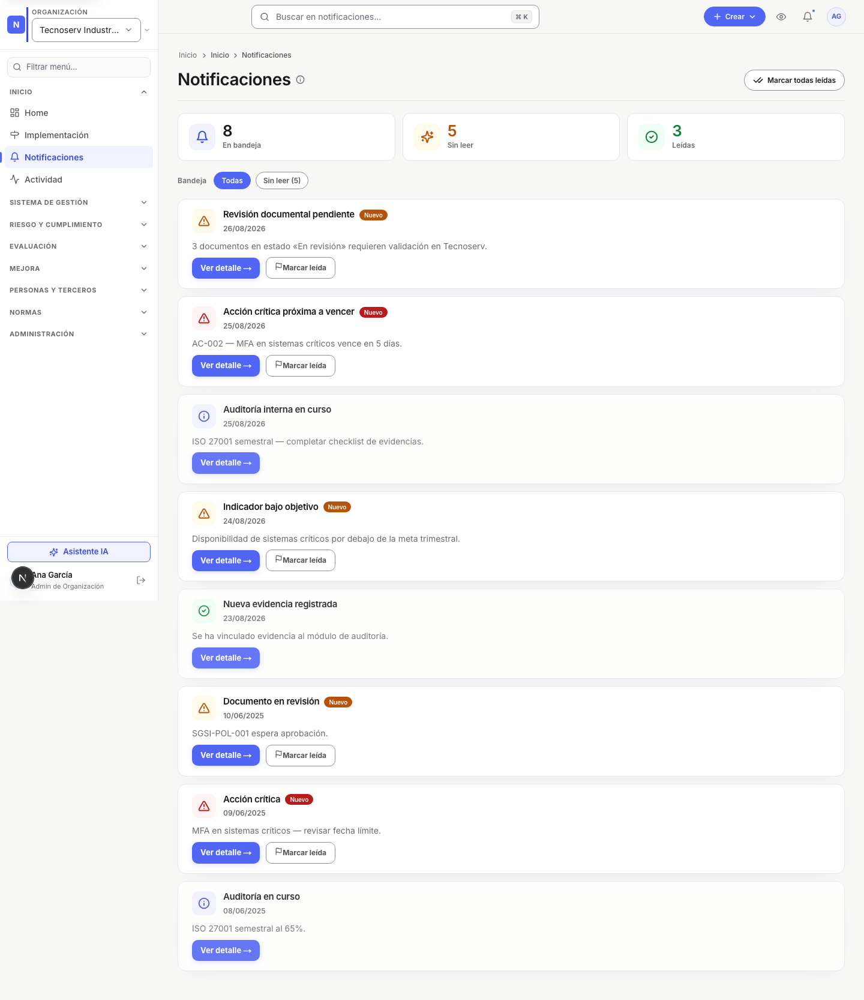

### 6.3. Actividad y audit trail

**Ruta:** Inicio → Actividad

Registro cronológico defendible de lo que ocurre en el espacio de trabajo: quién hizo qué, sobre qué entidad, cuándo y con qué motivo. Es la base de la trazabilidad exigida en auditoría.

Los filtros permiten acotar por actor, acción, entidad o rango de fechas, y cada evento tiene un detalle con los valores implicados.

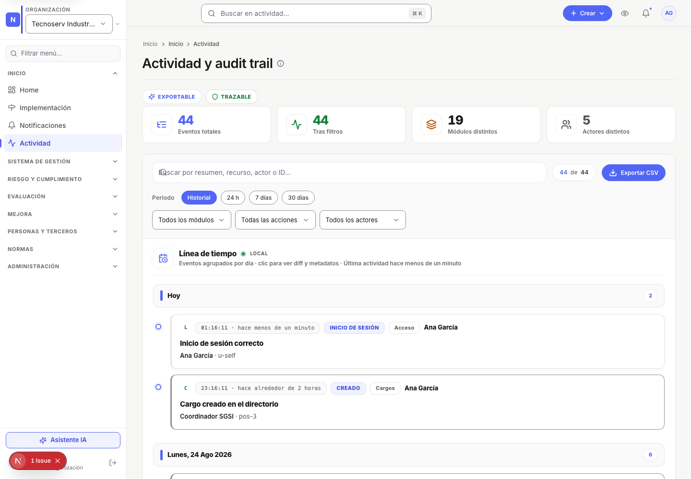

## 7. Sistema de gestión

### 7.1. Contexto de la organización

**Ruta:** Sistema de gestión → Contexto

Cubre las cláusulas 4.2 y 6.2, obligatorias en todas las normas de estructura Anexo SL: **partes interesadas** y **objetivos**. Es un módulo compartido —las mismas partes interesadas y objetivos sirven a todas las normas activas— y está siempre disponible, sin depender del plan.

**Qué registrar en cada parte interesada:** nombre, tipo, necesidades y expectativas, requisitos aplicables y cómo se les da seguimiento.

**Qué registrar en cada objetivo:** enunciado, norma o normas a las que responde, responsable, plazo, indicador asociado y estado de avance.

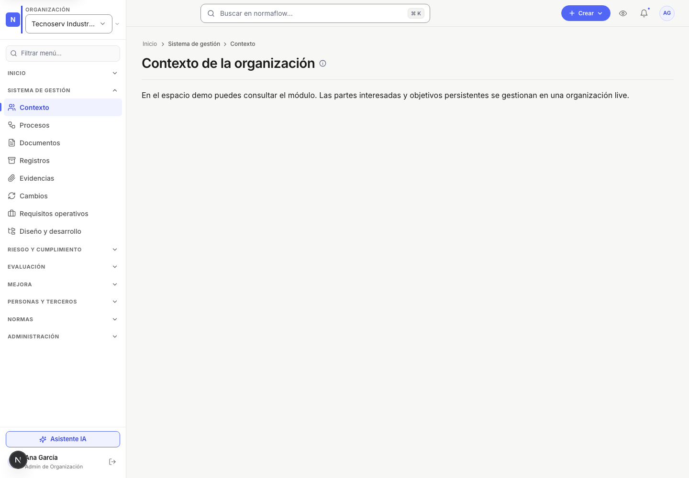

### 7.2. Gestión de Procesos

**Ruta:** Sistema de gestión → Procesos

Representa el mapa de procesos y conecta cada proceso con responsables, entradas, salidas, riesgos, indicadores, documentos y evidencias. Es el eje sobre el que se apoyan casi todos los demás módulos.

**Operaciones:**

- crear un proceso con código y descripción;
- asignar responsable y participantes;
- definir entradas, salidas y objetivos;
- enlazar documentos, riesgos e indicadores;
- consultar el detalle y la trazabilidad del proceso.

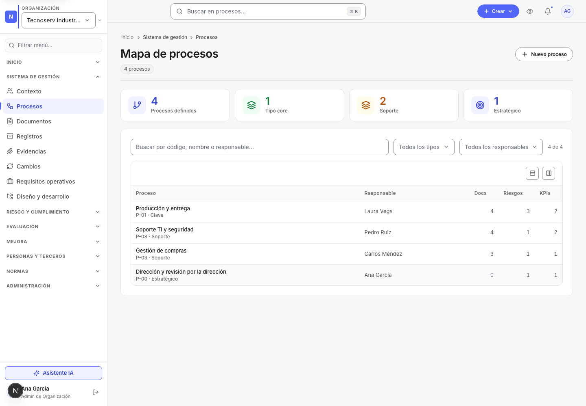

### 7.3. Control de Documentos

**Ruta:** Sistema de gestión → Documentos

Repositorio controlado de políticas, manuales, procedimientos, instrucciones, formularios y planes, con versionado y flujo de aprobación.

**Qué permite hacer:**

- buscar por título o código y filtrar por carpeta, tipo y estado;
- distinguir aprobados, en revisión, borradores y obsoletos;
- crear documentos con título, código, tipo, norma, cláusula y proceso asociado;
- adjuntar el archivo y consultar la vista previa;
- revisar el historial de versiones y los cambios entre ellas;
- aprobar o declarar obsoleto cuando el rol lo permita.

**Crear un documento:**

1. Pulsa **Nuevo documento**.
2. Introduce título y código.
3. Selecciona el tipo documental.
4. Añade norma, cláusula y proceso asociado.
5. Adjunta el archivo.
6. Pulsa **Crear Documento**.

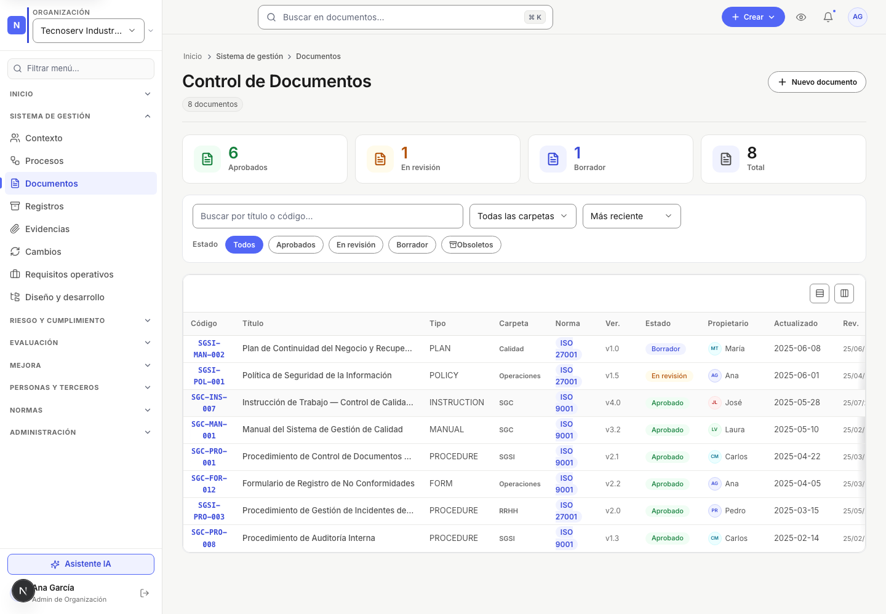

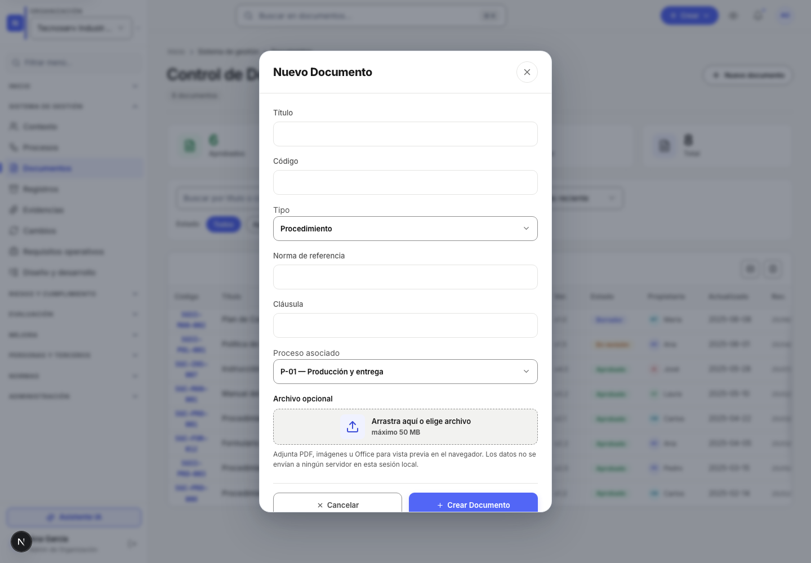

### 7.4. Control de Registros

**Ruta:** Sistema de gestión → Registros

Controla los registros que deben conservarse como evidencia del sistema. Cada registro se define con su identificación, responsable, ubicación, tiempo de retención, disposición final y método de archivo — valores que se toman de los catálogos descritos en el capítulo 13.

Además del registro maestro, el módulo admite **versiones de formato** y **entradas con adjuntos**: el formulario vigente queda versionado y cada cumplimentación se conserva con sus archivos.

**Flujo:**

1. Define o selecciona el tipo de registro.
2. Indica responsable, ubicación y periodo de retención.
3. Publica la versión del formato que se va a usar.
4. Registra cada entrada o evidencia con sus adjuntos.
5. Aplica la disposición cuando venza la retención.

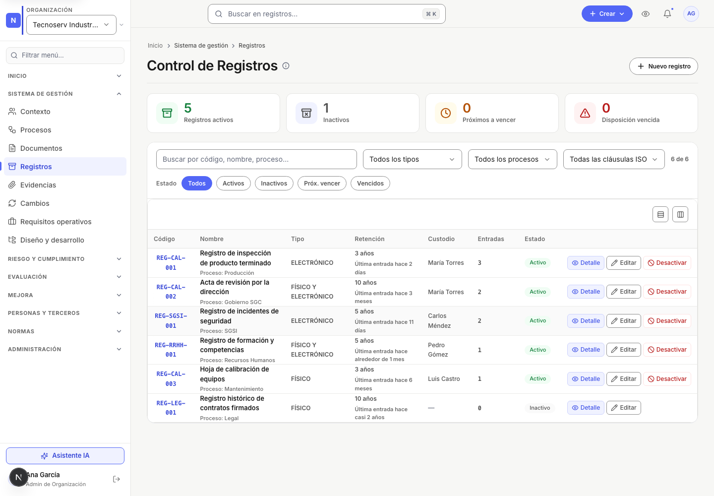

### 7.5. Repositorio de Evidencias

**Ruta:** Sistema de gestión → Evidencias

Centraliza los archivos que demuestran la ejecución del sistema: actas, registros, capturas, certificados, informes o mediciones. Cada evidencia puede enlazarse al proceso, requisito, control o auditoría que respalda.

**Buenas prácticas:** usa nombres consistentes, enlaza siempre la evidencia al requisito que satisface y conserva fecha y responsable de carga. En organizaciones multinorma, una misma evidencia puede satisfacer requisitos de varias normas: enlázala a todos ellos en vez de duplicar el archivo.

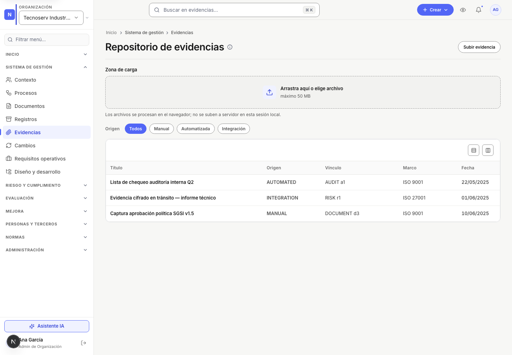

### 7.6. Control de Cambios

**Ruta:** Sistema de gestión → Cambios

Registra solicitudes de cambio en el sistema de gestión y controla su ciclo: solicitud, análisis de impacto, aprobación, implementación, verificación y cierre.

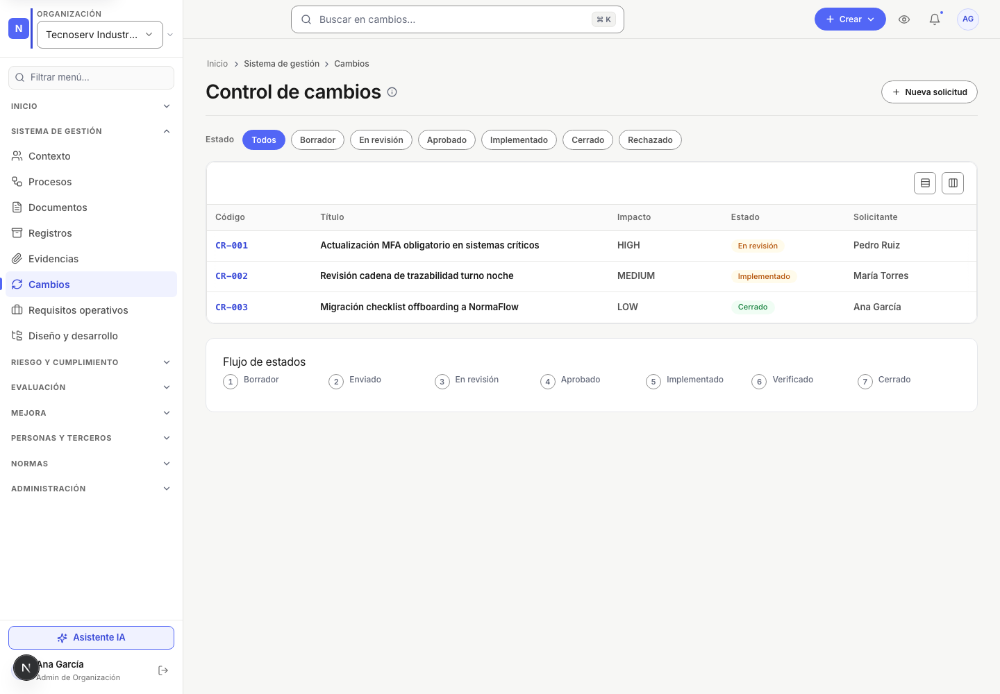

### 7.7. Requisitos operativos

**Ruta:** Sistema de gestión → Requisitos operativos

Cubre los requisitos operativos de ISO 9001 que no tienen módulo propio: requisitos del cliente (§7.2), comunicación (§7.4), propiedad del cliente (§8.5.3), preservación (§8.5.4) y satisfacción del cliente (§9.1.2).

Es el sitio donde se documenta qué pide el cliente, qué bienes suyos se custodian, cómo se preserva el producto o servicio y cómo se mide su satisfacción.

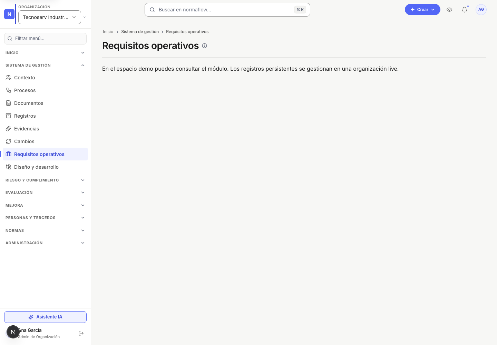

### 7.8. Diseño y desarrollo

**Ruta:** Sistema de gestión → Diseño y desarrollo

Gestiona proyectos de diseño y desarrollo según ISO 9001 §8.3, con etapas configurables. Cada proyecto recorre entradas, salidas, revisión, verificación, validación y transferencia, y conserva los registros de cada etapa.

> Este módulo es el §8.3 genérico. Las organizaciones de dispositivos médicos usan además el expediente de diseño (DHF) del módulo **Dispositivos médicos**, que responde a requisitos distintos de ISO 13485.

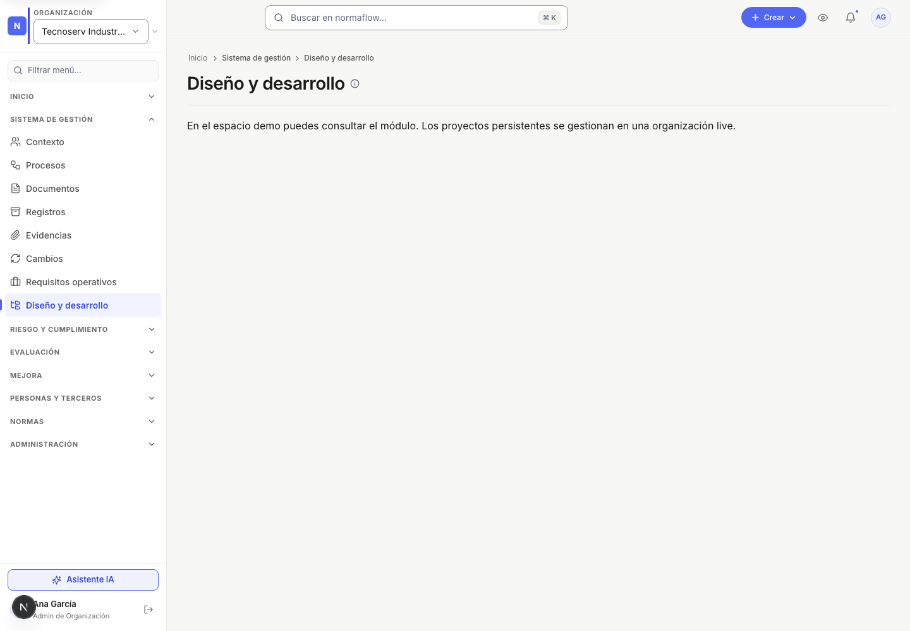

## 8. Riesgo y cumplimiento

### 8.1. Gestión de Riesgos

**Ruta:** Riesgo y cumplimiento → Riesgos

Registro para identificar, valorar y tratar riesgos. La pantalla combina un mapa de calor 5×5 con el registro detallado.

**Registrar un riesgo:**

1. Pulsa **Nuevo Riesgo**.
2. Introduce el título y la categoría.
3. Asigna responsable y proceso asociado.
4. Valora **probabilidad** e **impacto** de 1 a 5.
5. Define vencimiento, control existente, estado y tratamiento.
6. Pulsa **Guardar**.

El score resulta de combinar probabilidad e impacto, y el sistema separa riesgos críticos, altos y moderados para facilitar la priorización. Los riesgos alimentan después el plan de tratamiento, la Declaración de Aplicabilidad y los módulos normativos.

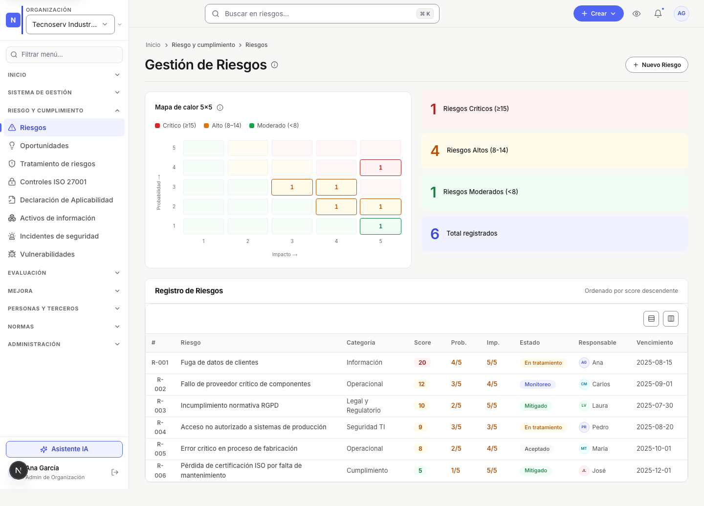

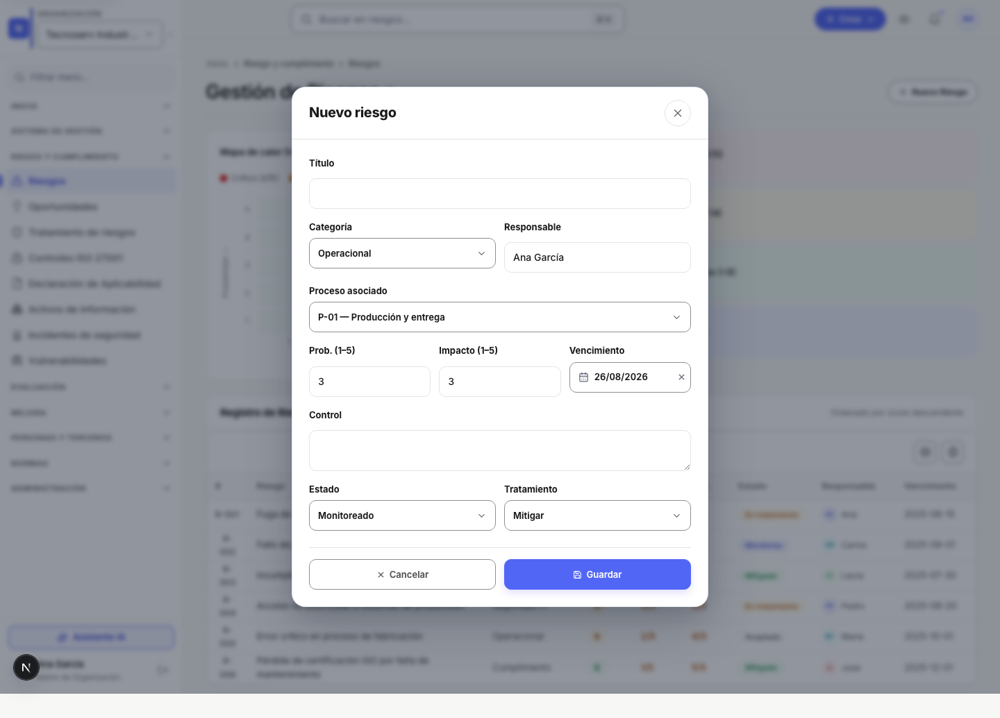

### 8.2. Oportunidades

**Ruta:** Riesgo y cumplimiento → Oportunidades

Contrapartida positiva del registro de riesgos, exigida por la cláusula 6.1. Permite analizar oportunidades de mejora, asignar un revisor y documentar si llegaron a materializarse y con qué resultado.

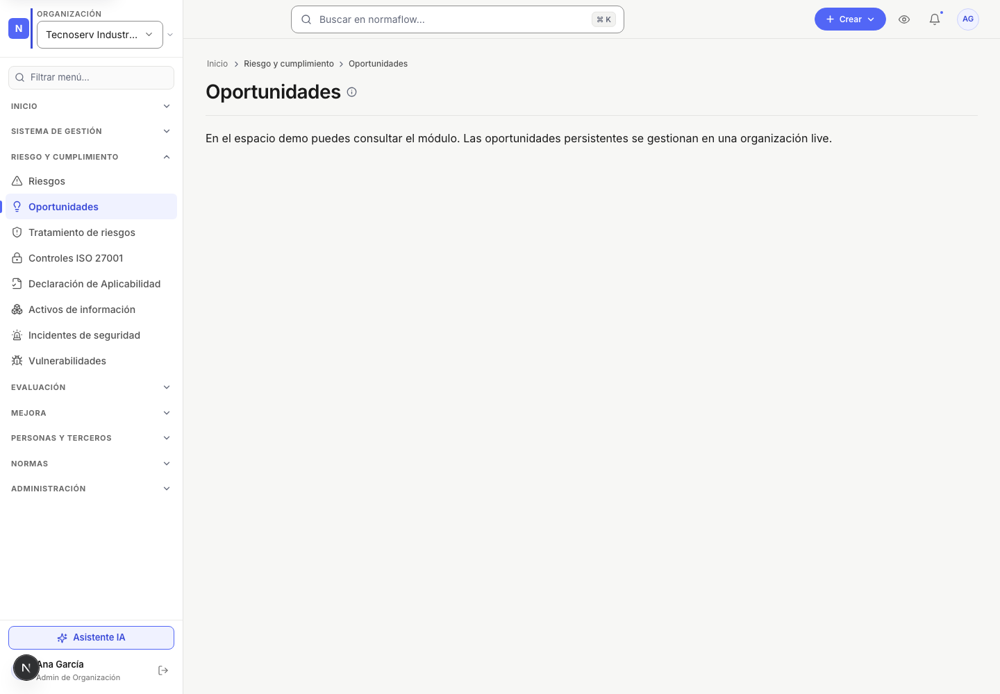

### 8.3. Tratamiento de riesgos

**Ruta:** Riesgo y cumplimiento → Tratamiento de riesgos

Plan formal de tratamiento: para cada riesgo aceptado, mitigado, transferido o evitado, recoge la decisión, los controles aplicados, el responsable, el plazo y el riesgo residual resultante.

Es el documento que conecta el registro de riesgos con los controles del Anexo A y con la Declaración de Aplicabilidad, y el que suele pedir el auditor de ISO 27001 para comprobar que las decisiones sobre riesgo están justificadas y aprobadas.

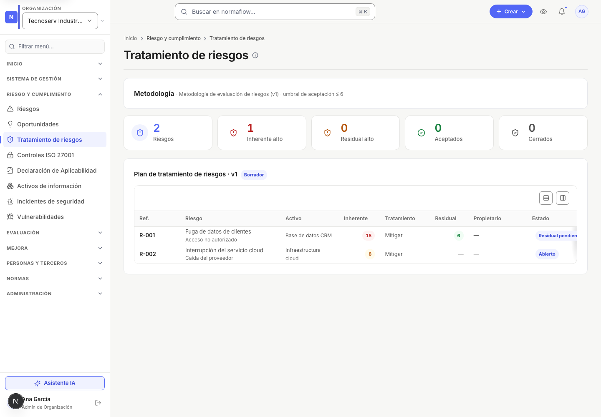

### 8.4. Controles ISO 27001

**Ruta:** Riesgo y cumplimiento → Controles ISO 27001

Catálogo operativo y versionado del Anexo A de ISO/IEC 27001:2022, con aplicabilidad, evidencia, riesgos asociados y revisiones periódicas de cada control.

**Qué se gestiona en cada control:** estado de implantación, responsable, aplicabilidad, evidencias que lo demuestran, riesgos que mitiga y fecha de la próxima revisión.

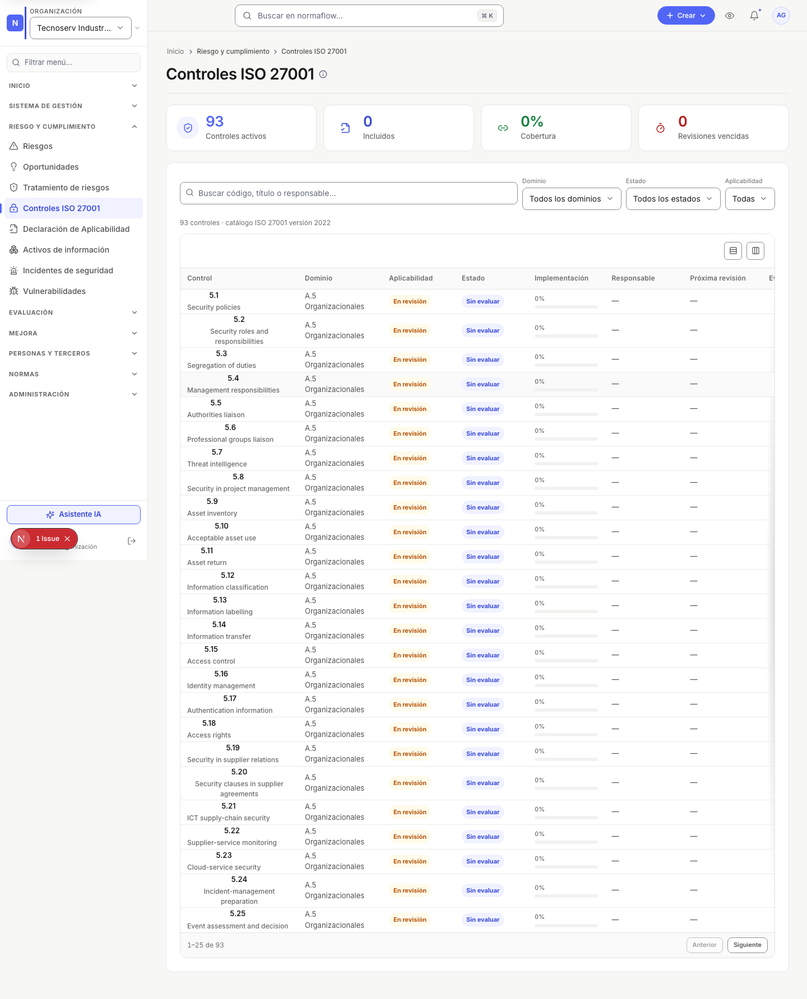

### 8.5. Declaración de Aplicabilidad (SoA)

**Ruta:** Riesgo y cumplimiento → Declaración de Aplicabilidad

Declaración versionada del Anexo A: para cada control, su inclusión o exclusión **con justificación**, el estado de implantación, el riesgo que lo motiva y la evidencia que lo respalda.

La SoA es un entregable obligatorio de la certificación ISO 27001. Al versionarla, cada revisión queda sellada con su fecha y responsable, de modo que puede demostrarse qué se declaraba en cada momento.

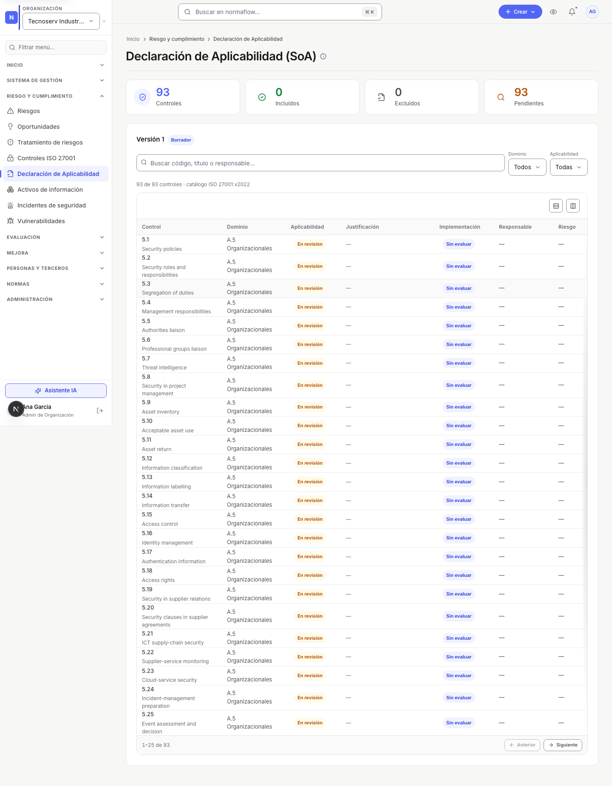

### 8.6. Activos de información

**Ruta:** Riesgo y cumplimiento → Activos de información

Inventario de activos con propietario, custodio, clasificación **CIA** (confidencialidad, integridad, disponibilidad), dependencias, riesgos asociados y controles del Anexo A aplicados a cada activo.

**Uso recomendado:** clasifica primero por criticidad, asigna propietario a cada activo y enlaza los riesgos antes de decidir controles. Un activo sin propietario es un hallazgo habitual en auditoría.

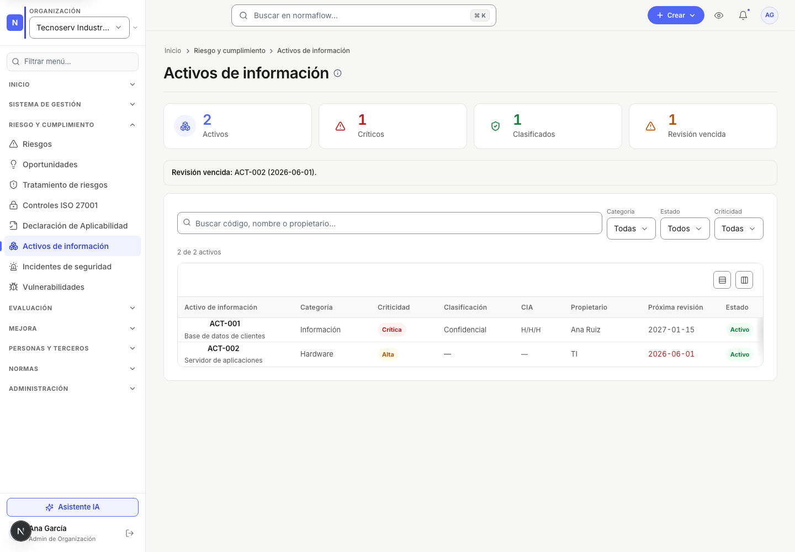

### 8.7. Incidentes de seguridad

**Ruta:** Riesgo y cumplimiento → Incidentes de seguridad

Gestión de incidentes de seguridad de la información: clasificación, severidad, activos afectados, cronología de la respuesta, evidencias recogidas y lecciones aprendidas.

Los incidentes pueden derivar en no conformidades y acciones correctivas sin salir del sistema, conservando el vínculo entre el incidente y su tratamiento.

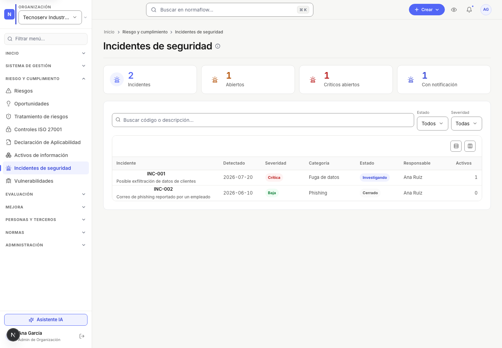

### 8.8. Vulnerabilidades

**Ruta:** Riesgo y cumplimiento → Vulnerabilidades

Gestión del ciclo de vida de vulnerabilidades técnicas: origen del hallazgo, identificador CVE, severidad, activos expuestos, plan de remediación y verificación del cierre.

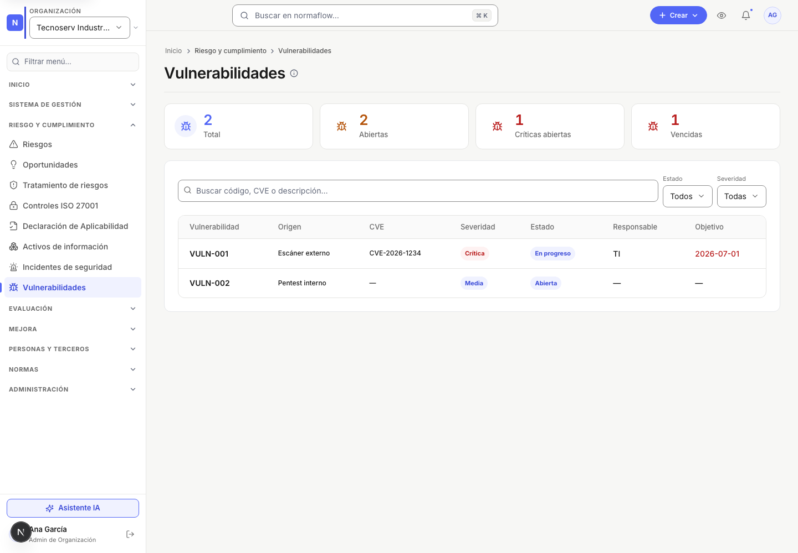

## 9. Evaluación del desempeño

### 9.1. GAP Assessment

**Ruta:** Evaluación → GAP Assessment

Evalúa el cumplimiento de cada cláusula de las normas activas. Cada cláusula muestra porcentaje, estado y número de respuestas registradas.

**Funciones principales:**

- cambiar de norma entre todas las activas en la organización;
- abrir una cláusula y responder sus preguntas de evaluación;
- consultar el cumplimiento global y por capítulo;
- distinguir conforme, parcialmente conforme y no conforme;
- ver recomendaciones de mejora;
- exportar el informe en PDF;
- solicitar una sugerencia de IA para convertir brechas en un plan de acción.

**Uso recomendado:** responde primero las cláusulas con evidencia disponible, documenta las brechas y prioriza las áreas con menor puntuación. En organizaciones multinorma, revisa la matriz de correspondencia antes de responder: una cláusula equivalente ya respondida en otra norma puede reutilizar la misma evidencia.

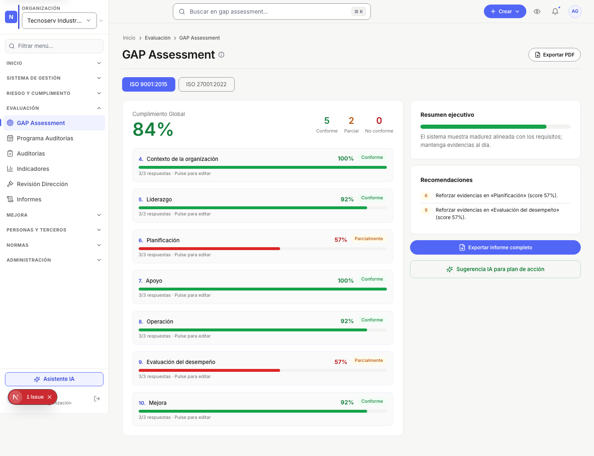

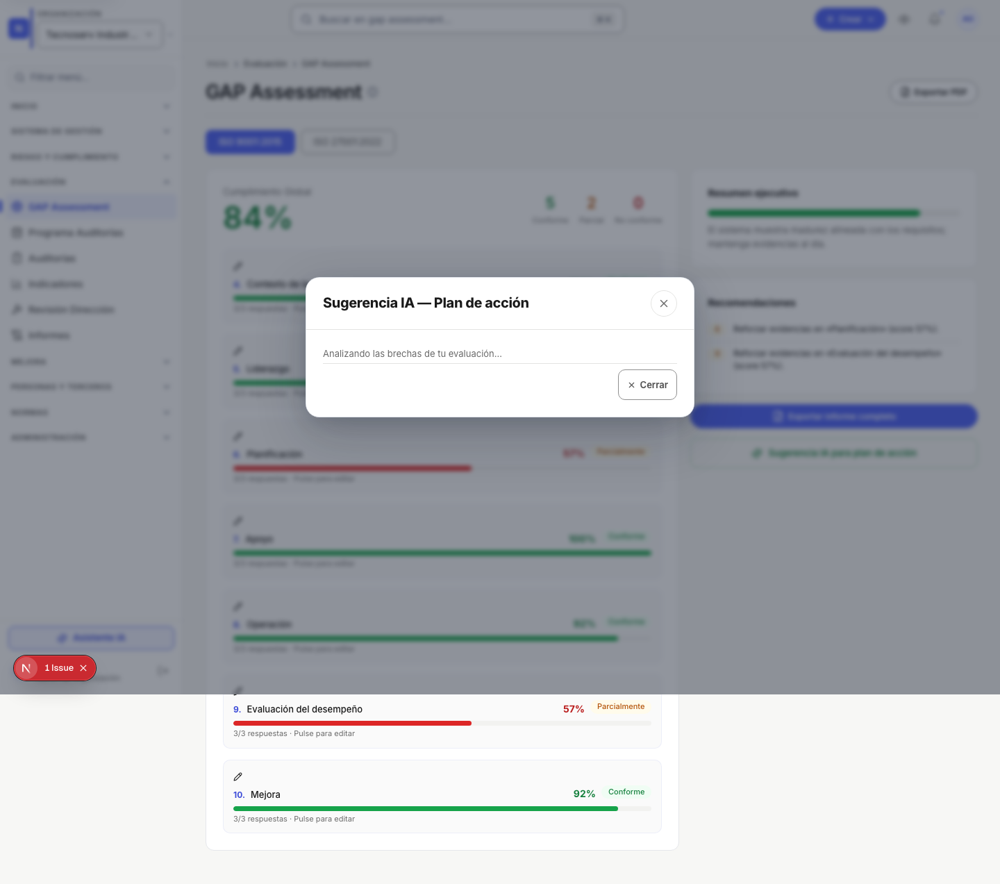

> La IA es un apoyo de análisis. Las recomendaciones deben ser revisadas y aprobadas por una persona responsable antes de convertirse en acciones oficiales.

### 9.2. Programa anual de auditorías

**Ruta:** Evaluación → Programa Auditorías

Define el programa anual: objetivo, alcance, normas cubiertas, periodos y auditorías previstas. Es la vista de planificación de alto nivel que exige la cláusula 9.2, y la que demuestra que las auditorías responden a un plan y no a decisiones puntuales.

### 9.3. Auditorías

**Ruta:** Evaluación → Auditorías

Gestiona la ejecución de cada auditoría individual.

**Funciones:**

- crear la auditoría y definir su alcance;
- indicar fecha, equipo auditor y normas evaluadas;
- ejecutar el checklist con evidencias por punto;
- registrar hallazgos y clasificarlos;
- generar no conformidades desde los hallazgos;
- cerrar formalmente la auditoría con su informe.

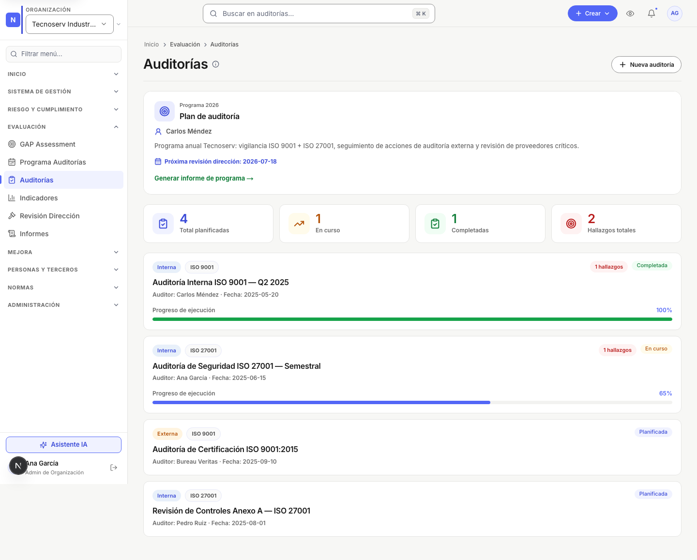

### 9.4. Indicadores y KPIs

**Ruta:** Evaluación → Indicadores

Define indicadores para medir procesos y objetivos.

**Configurar un KPI:**

1. Pulsa **Nuevo KPI**.
2. Define nombre, proceso y responsable.
3. Indica objetivo, unidad, frecuencia y umbrales.
4. Registra los valores periódicos.
5. Revisa tendencia y desviaciones.
6. Adjunta evidencias o comentarios de análisis.

Los módulos normativos aportan sus propios indicadores calculados —índices de frecuencia y gravedad en seguridad y salud, EnPI en energía, cumplimiento de SLA en ITSM— que conviven con los KPIs definidos manualmente.

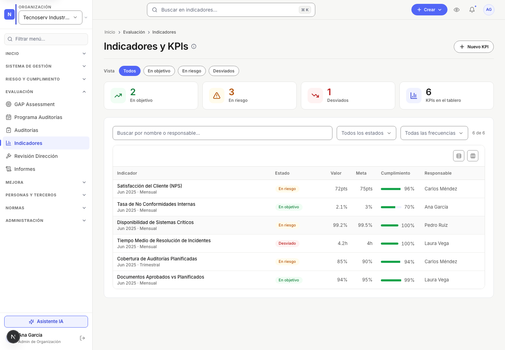

### 9.5. Revisión por la dirección

**Ruta:** Evaluación → Revisión Dirección

Organiza las reuniones de revisión del sistema por la dirección según la cláusula 9.3.

**Permite documentar:**

- fecha, título y participantes;
- entradas de la revisión (resultados de auditorías, indicadores, no conformidades, riesgos, partes interesadas);
- temas tratados y decisiones;
- acciones derivadas con responsable y plazo;
- seguimiento de los acuerdos de revisiones anteriores.

En un sistema integrado, una única revisión por la dirección puede cubrir todas las normas activas: el módulo permite indicar a qué normas responde cada entrada y cada decisión.

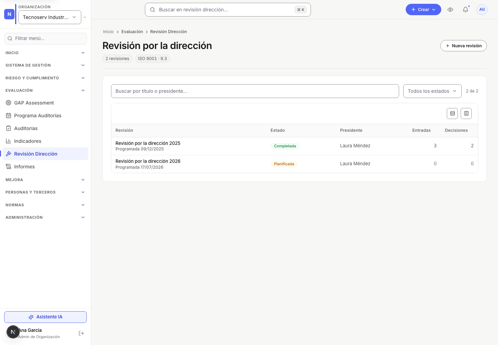

### 9.6. Informes y paquetes de auditoría

**Ruta:** Evaluación → Informes

Prepara paquetes trazables para comité, dirección o auditor externo. Junto a los informes generales del sistema, cada módulo normativo aporta su propio catálogo de informes: aspectos ambientales significativos, obligaciones legales, indicadores de seguridad y salud, oportunidades energéticas, trazabilidad alimentaria, vigilancia de dispositivos y paquetes de auditoría por norma.

La pantalla reúne los informes disponibles, sus formatos de exportación y el historial de generación.

## 10. Mejora

### 10.1. No Conformidades y CAPA

**Ruta:** Mejora → No Conformidades

Registra desviaciones, hallazgos y problemas que requieren corrección, y gestiona las acciones correctivas y preventivas asociadas.

**Flujo recomendado:**

1. Registra la no conformidad con su origen, norma, cláusula y descripción.
2. Aplica la corrección inmediata si procede.
3. Analiza la causa raíz.
4. Define la acción correctiva con responsable y vencimiento.
5. Adjunta evidencias de implementación.
6. Verifica la eficacia transcurrido el plazo.
7. Cierra la no conformidad solo cuando la eficacia esté demostrada.

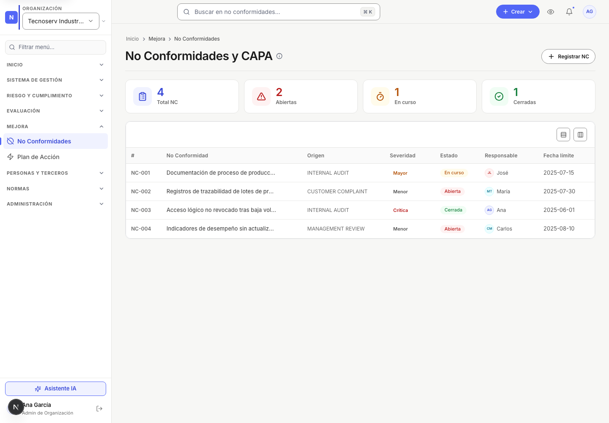

### 10.2. Plan de Acción

**Ruta:** Mejora → Plan de Acción

Agrupa en una sola lista todas las acciones del sistema, vengan del GAP, de auditorías, de riesgos, de no conformidades, de incidentes o de la revisión por la dirección.

**Qué revisar en cada acción:** responsable, fecha objetivo, prioridad, estado, origen, comentarios y evidencias de cierre. Es la pantalla natural para la reunión semanal de seguimiento.

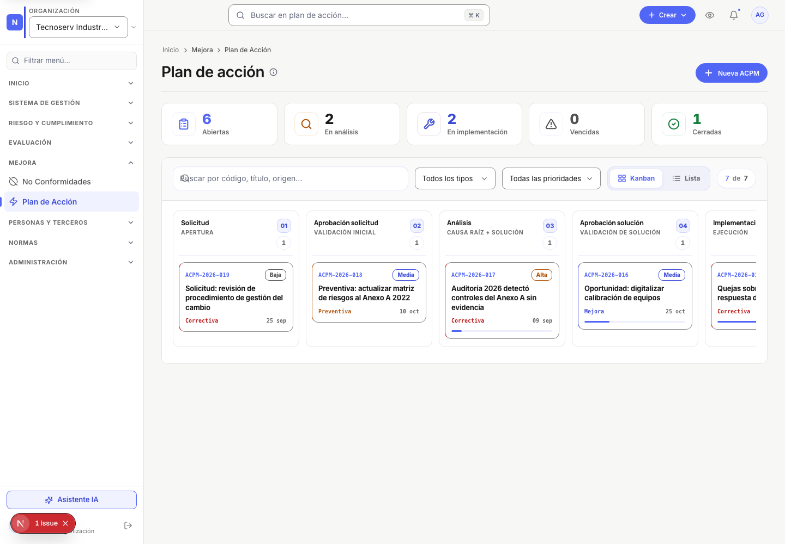

## 11. Personas y terceros

### 11.1. Personal

**Ruta:** Personas y terceros → Personal

Personas que pertenecen a la organización, tengan o no acceso al sistema. Se distingue del módulo de usuarios: aquí está la plantilla real —incluidos quienes nunca entran a NormaFlow—, mientras que **Usuarios y roles** gestiona las cuentas de acceso.

Cada ficha admite cargo, área, fecha de incorporación, competencias y formación asociada.

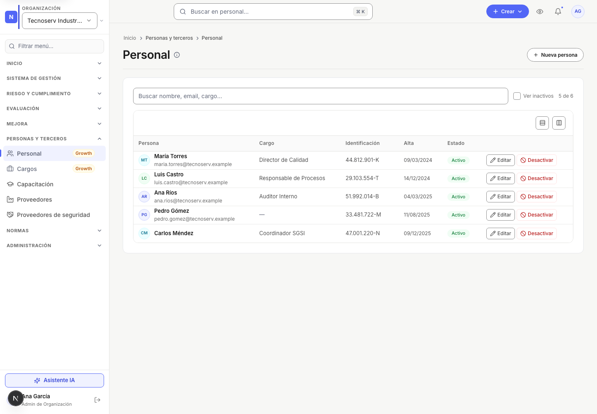

### 11.2. Cargos

**Ruta:** Personas y terceros → Cargos

Estructura organizativa y perfiles de puesto. Cada cargo define funciones, responsabilidades y competencias requeridas, y cada persona puede asociarse a uno. Es la base para demostrar competencia según la cláusula 7.2.

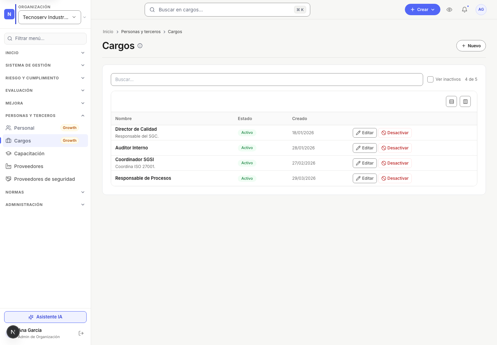

### 11.3. Gestión de Capacitación

**Ruta:** Personas y terceros → Capacitación

Administra cursos, asignaciones, asistencia, avance y evaluación de la eficacia de la formación, con relación a procesos y competencias.

**Flujo:** define el curso, asigna participantes, registra la asistencia, conserva el certificado o evidencia y evalúa si la formación fue eficaz.

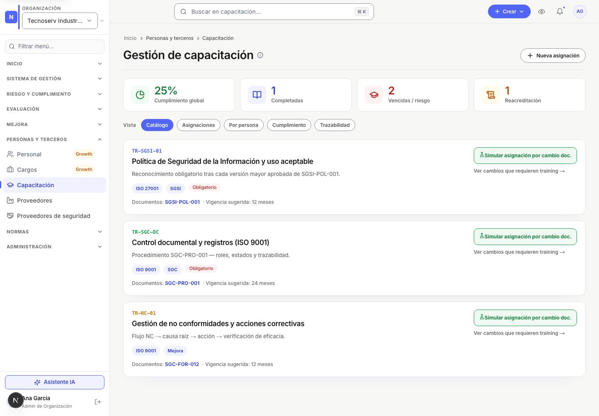

### 11.4. Proveedores y contratistas

**Ruta:** Personas y terceros → Proveedores

Centraliza la evaluación de proveedores: criticidad, homologación, reevaluaciones periódicas, riesgos, documentos y evidencias asociadas.

**Uso recomendado:** clasifica primero la criticidad, asigna responsable de revisión y conserva las evidencias de homologación y seguimiento. Los proveedores críticos deben tener reevaluación con fecha.

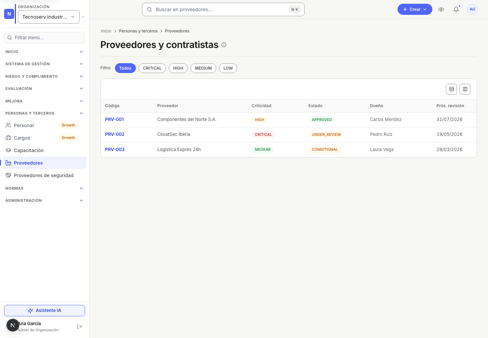

### 11.5. Proveedores de seguridad

**Ruta:** Personas y terceros → Proveedores de seguridad

Evaluación de proveedores desde la perspectiva de ISO 27001: qué información maneja cada tercero, qué acuerdos de seguridad y confidencialidad se han firmado, qué controles se le exigen y cómo se supervisa su cumplimiento.

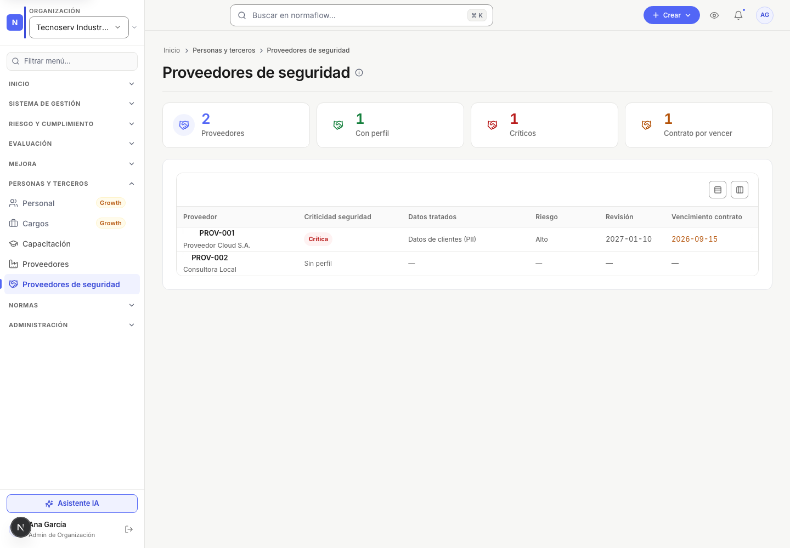

## 12. Normas y paquetes normativos

Este es el bloque que más ha crecido desde la versión anterior del manual. Conviene entender primero cómo funciona el motor de normas antes de entrar en cada módulo.

### 12.1. Cómo funcionan los paquetes normativos

Una norma en NormaFlow es un **paquete de datos**, no una funcionalidad programada a medida. Cada paquete aporta:

- el árbol completo de cláusulas y requisitos de la norma, en su edición concreta;
- el catálogo de evidencias y documentos que la norma espera;
- las preguntas de evaluación que alimentan el GAP Assessment;
- las correspondencias con las demás normas del catálogo.

De ahí salen tres consecuencias prácticas:

1. **Activar una norma es inmediato.** No requiere despliegue ni configuración técnica: se instala el paquete y aparecen sus cláusulas, su GAP y su cobertura.
2. **Las ediciones conviven.** Una norma puede tener varias ediciones y la organización sabe sobre cuál está certificada.
3. **La cobertura es transversal.** Un mismo documento o evidencia puede satisfacer requisitos de varias normas a la vez, y el sistema lo registra en vez de duplicarlo.

Algunas normas se quedan en el paquete —cláusulas, GAP y evidencias— y otras añaden además un **módulo especializado** con datos propios del dominio: aspectos ambientales, peligros laborales, análisis de impacto en el negocio, obligaciones de compliance, lotes alimentarios o expedientes de dispositivos médicos. Los apartados siguientes describen esos módulos.

### 12.2. Normas ISO

**Ruta:** Normas → Normas ISO

Es el centro de control del sistema normativo. Se organiza en cinco secciones:

| Sección | Para qué sirve |
|---|---|
| **Panel integrado** | Estado general: normas activas, cobertura y avance por norma |
| **Catálogo** | Todas las normas disponibles, con su edición y su estado de licencia |
| **Normas activas** | Las normas instaladas en la organización, con opción de activar o retirar |
| **Matriz de requisitos** | Requisito a requisito, qué lo cubre y con qué evidencia |
| **Correspondencias** | Equivalencias entre requisitos de normas distintas |

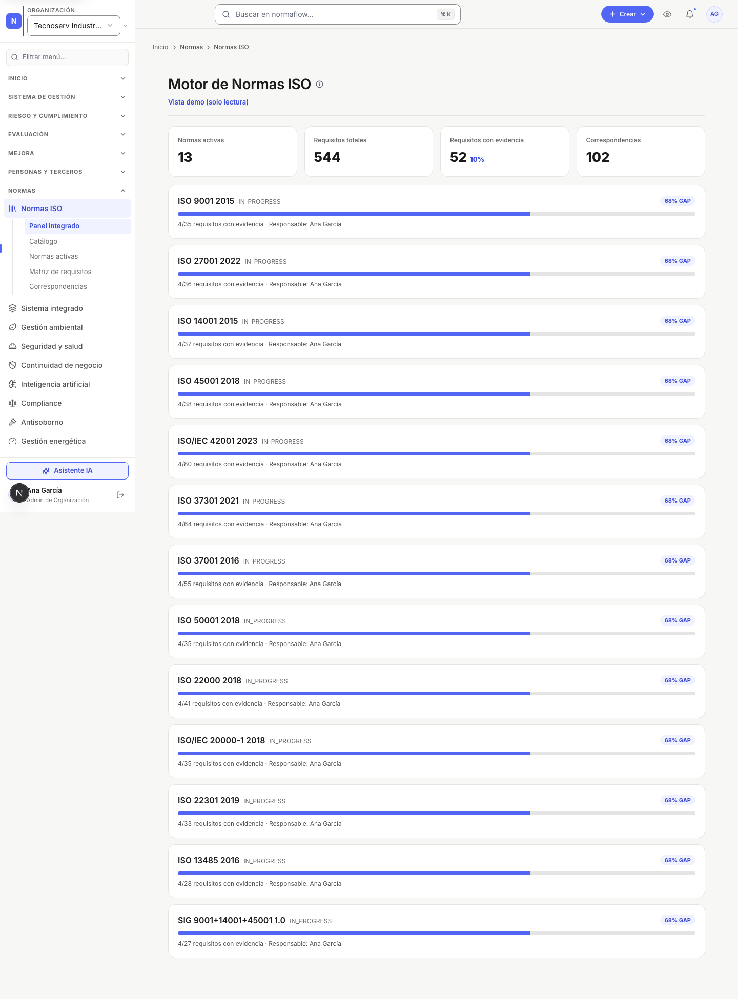

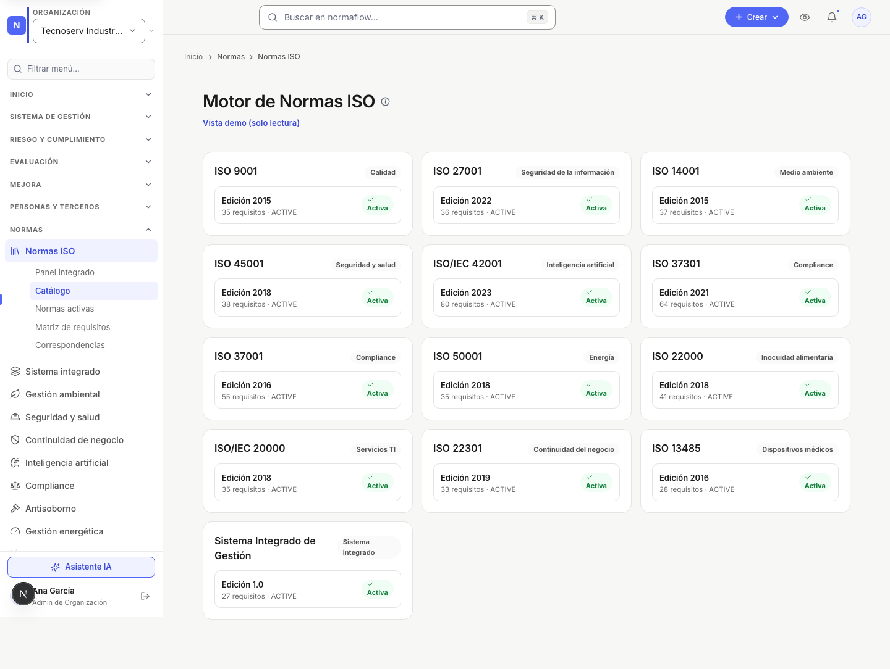

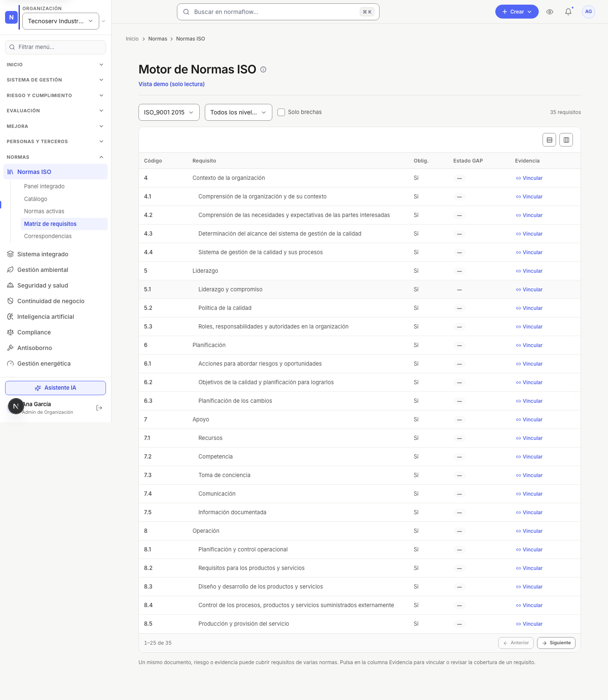

### 12.3. Sistema integrado (SIG)

**Ruta:** Normas → Sistema integrado

Cuando la organización opera más de una norma, este módulo evita el error más caro de un sistema integrado: mantener tres sistemas paralelos que dicen lo mismo con documentos distintos.

**Secciones:** panel integrado, alcance y política, partes interesadas, objetivos, matriz de correspondencia, auditoría integrada y elementos compartidos.

**La matriz de correspondencia** clasifica cada requisito frente a las demás normas activas:

| Clasificación | Significado |
|---|---|
| **Equivalente** | Existe un requisito equivalente en otra norma activa |
| **Parcialmente equivalente** | Solo hay correspondencia parcial o relacionada |
| **Específico** | Requisito propio de esa norma, sin correspondencia |

Sobre esa clasificación se añade una segunda dimensión —**compartible** o **no compartible**— que indica si el mismo documento, evidencia o responsable puede servir para ambas normas. Los requisitos equivalentes y parcialmente equivalentes siempre son compartibles.

**Cómo aprovecharlo:** antes de crear un documento nuevo, busca el requisito en la matriz. Si aparece como equivalente y ya tiene un documento asignado en otra norma, enlaza ese mismo documento en vez de escribir uno paralelo. La auditoría integrada se planifica igual: una sola auditoría puede cubrir los requisitos comunes de varias normas.

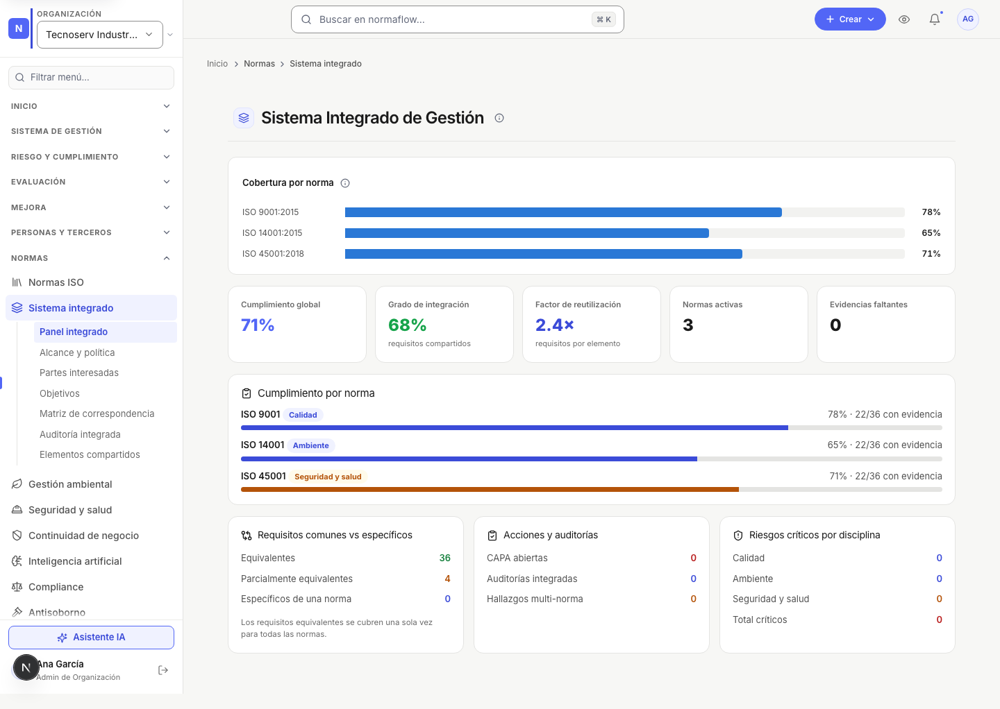

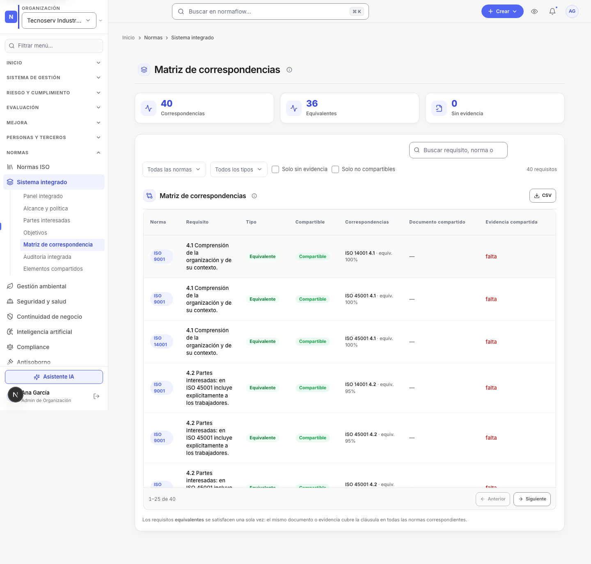

### 12.4. Gestión ambiental (ISO 14001)

**Ruta:** Normas → Gestión ambiental

**Secciones:** panel, aspectos e impactos, cumplimiento legal, objetivos, indicadores, residuos, emergencias y biodiversidad.

**Matriz de aspectos e impactos.** El corazón del módulo. Cada aspecto ambiental se registra con su **condición** —normal, anormal o de emergencia— y su etapa de ciclo de vida, y de él cuelgan los impactos que provoca.

**Cálculo de significancia.** La valoración usa una metodología configurable y versionada, con tres fórmulas posibles: suma ponderada, producto de severidad × frecuencia × alcance, o suma simple. La eficacia de los controles existentes (0-100) mitiga el valor bruto antes de compararlo con el umbral, y el resultado fija el nivel y la marca de aspecto significativo.

> Al crear una versión nueva de la metodología, la anterior no se sobrescribe: queda desactivada pero conservada, y se pueden recalcular todos los impactos contra el método activo. Así puede demostrarse con qué criterio se valoró cada aspecto en cada momento.

**Cumplimiento legal.** Registro de obligaciones legales aplicables y sus evaluaciones periódicas de cumplimiento, con estados de vencido o incumplido.

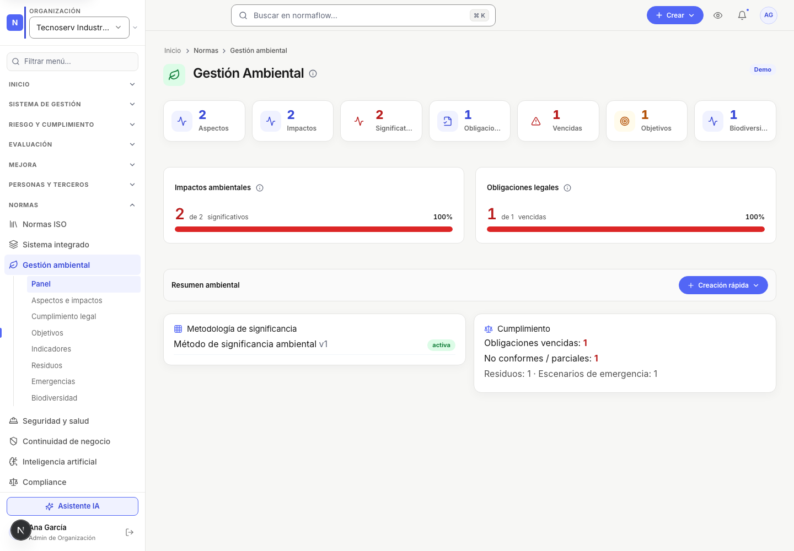

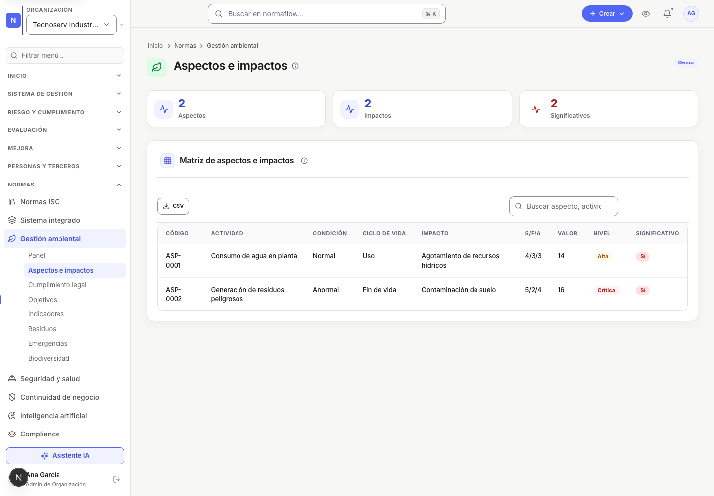

### 12.5. Seguridad y salud en el trabajo (ISO 45001)

**Ruta:** Normas → Seguridad y salud

**Secciones:** panel, peligros y riesgos, consulta a trabajadores, incidentes, inspecciones, EPP, permisos de trabajo, emergencias, contratistas y vigilancia de la salud.

**Evaluación de riesgo laboral.** Usa el método **W. T. Fine**: magnitud = probabilidad × consecuencia × exposición. La eficacia de los controles existentes mitiga el valor antes de clasificar el riesgo inherente y residual, y la aceptabilidad resultante es aceptable, tolerable o no aceptable. La metodología está versionada, igual que en el módulo ambiental.

**Investigación de incidentes.** El flujo es estrictamente lineal y no admite saltos ni retrocesos:

Reportado → Clasificado → En investigación → Causa raíz → Plan de acción → Implementado → Eficacia verificada → Cerrado

Un incidente no puede cerrarse sin haber pasado por las siete etapas previas. La restricción se aplica tanto en la aplicación como en la propia base de datos, de modo que el historial de la investigación es defendible ante un auditor o una autoridad laboral.

**Permisos de trabajo.** Tienen su propio ciclo controlado: borrador → activo → suspendido, cerrado o caducado.

**Vigilancia de la salud.** Contiene información médica de trabajadores identificados, por lo que está protegida con un permiso reforzado propio: nunca se concede a contribuidores ni visores, y el rol auditor solo puede consultarla y exportarla.

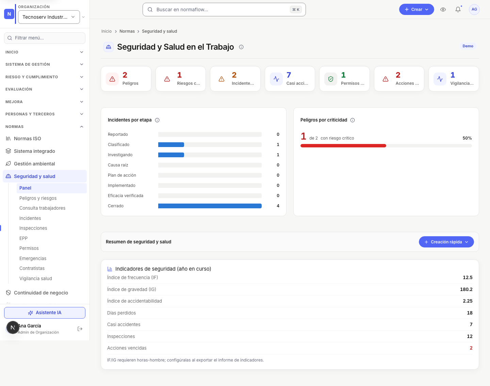

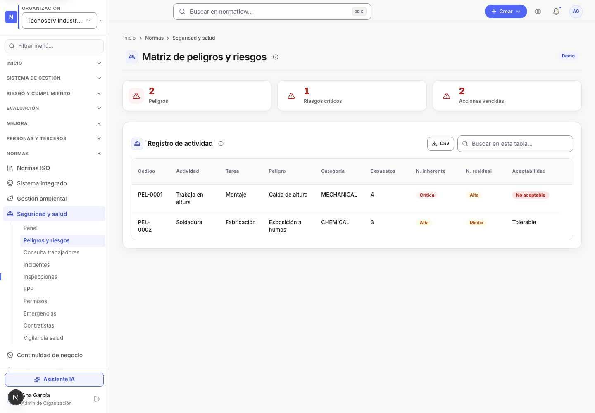

### 12.6. Continuidad de negocio (ISO 22301)

**Ruta:** Normas → Continuidad de negocio

**Secciones:** panel, planes, BIA y actividades, dependencias y recursos, estrategias, equipos de crisis, simulacros y brechas.

**Análisis de impacto en el negocio (BIA).** Cada actividad se valora sobre cinco categorías de impacto —financiero, operacional, legal, reputacional y personas— y se combina con su urgencia. Una actividad con MTPD de una hora o menos se clasifica como crítica aunque su impacto sea moderado.

**Regla dura:** el RTO nunca puede superar el MTPD. El sistema lo impide al crear y al actualizar una actividad.

**Detección de brechas.** El módulo señala automáticamente las carencias del programa: actividades sin MTPD o sin RTO, RTO superior al MTPD, actividades sin estrategia, estrategias con RTO insuficiente, ausencia de procedimiento, puntos únicos de fallo y planes nunca probados.

**Ciclo de vida del plan:**

1. **Versionar** — cada versión se guarda en un histórico inmutable y devuelve el plan a borrador: toda versión nueva exige una aprobación nueva.
2. **Aprobar** — sella plan y versión con aprobador y fecha.
3. **Activar** — solo admite planes aprobados; registra motivo, escenario e incidente que la motivan.
4. **Cerrar** — recoge resultado, lecciones aprendidas y evidencia, conservando el histórico de activaciones.

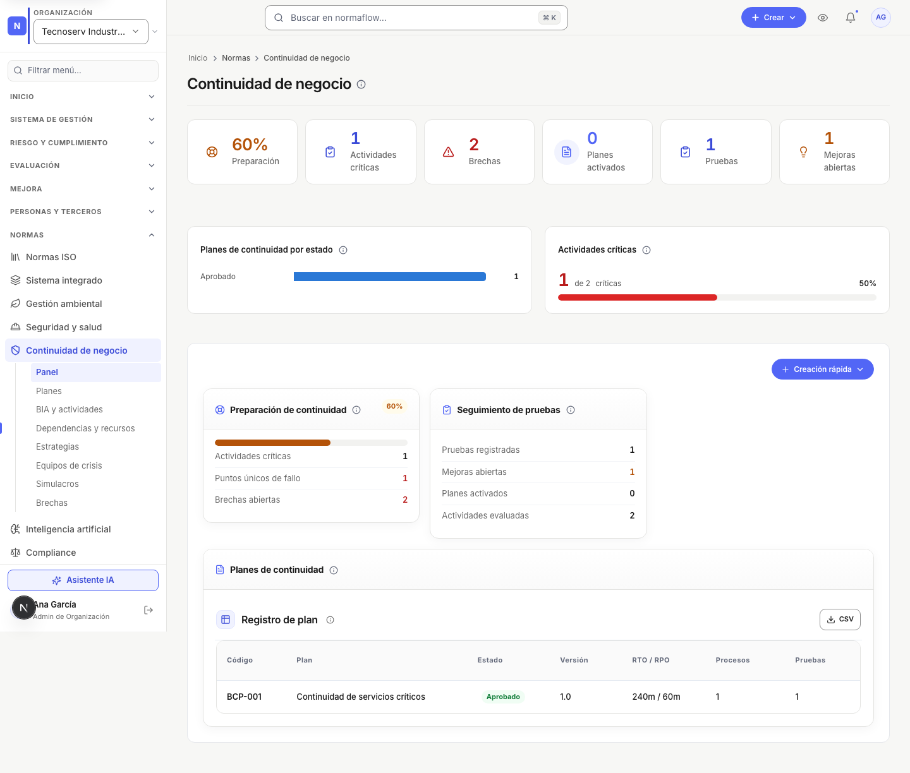

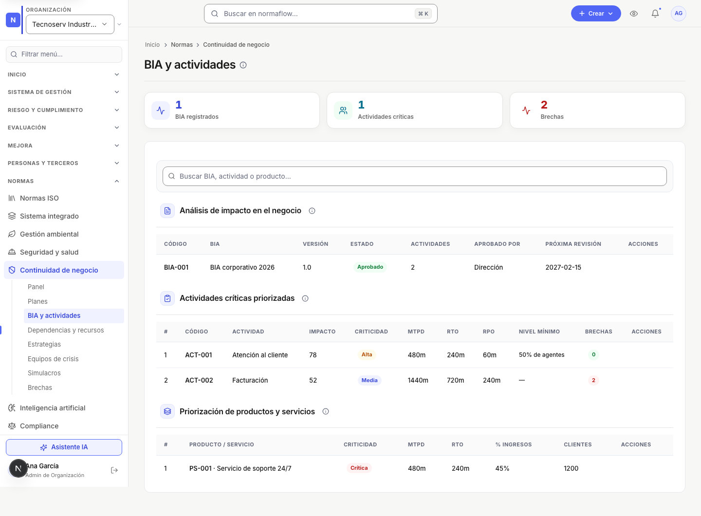

### 12.7. Inteligencia artificial (ISO/IEC 42001)

**Ruta:** Normas → Inteligencia artificial

**Secciones:** panel, inventario de IA, revisión humana, evaluación de impacto, riesgos, datos, modelos, supervisión, transparencia, incidentes, proveedores, cambios y monitoreo.

**La regla humana.** Es el principio que ordena todo el módulo: nada generado por IA se convierte en registro oficial sin aprobación de una persona.

Borrador → Revisión humana → Aprobado → registro oficial, o bien Rechazado → vuelta a borrador

Se aplica a cinco artefactos: salidas generadas por IA, evaluaciones de impacto, versiones de modelo, solicitudes de cambio y la puesta en producción de un sistema de IA.

**Trazabilidad de una decisión asistida.** Cada salida conserva el prompt y sus parámetros, el modelo y su versión, la salida cruda, quién la solicitó y cuándo, las ediciones humanas por separado de la salida original, la aprobación con su revisor y nota de decisión, y a qué registro oficial se promovió.

> Que la edición humana se guarde aparte de la salida cruda es deliberado: el auditor puede ver exactamente qué propuso el modelo y qué corrigió la persona.

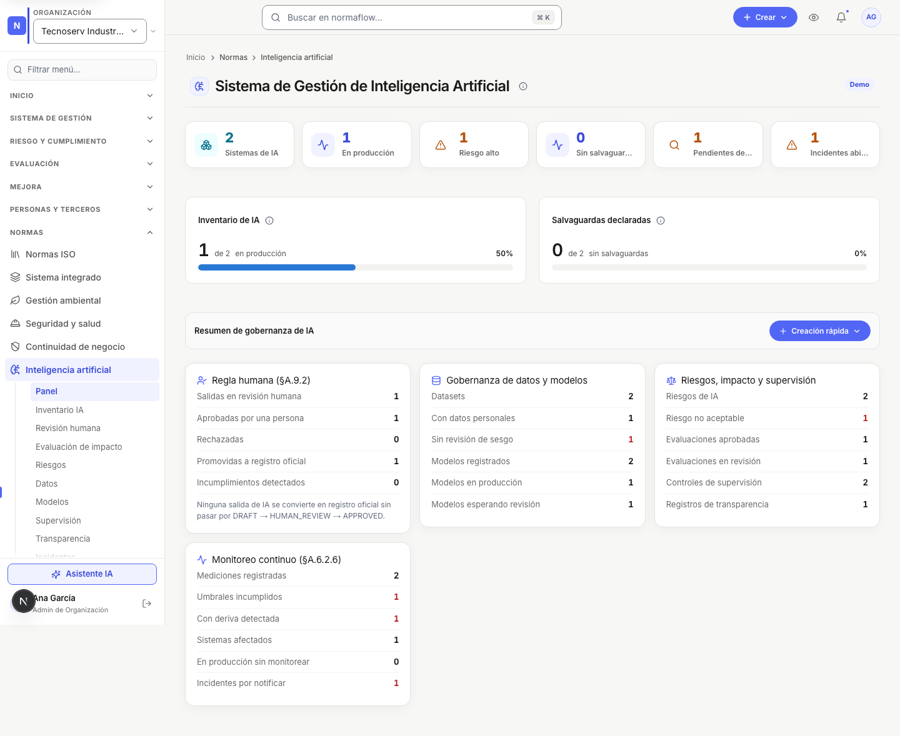

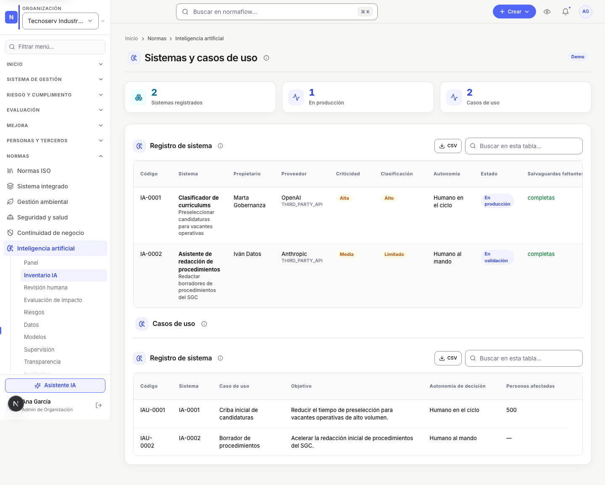

### 12.8. Compliance (ISO 37301)

**Ruta:** Normas → Compliance

**Secciones:** panel, obligaciones, fuentes y jurisdicciones, riesgos, controles, evaluaciones, calendario, cambios regulatorios, conflictos de interés, canal de denuncias, investigaciones, incumplimientos, remediación, formación y órgano de gobierno.

**Obligaciones de compliance.** Cada obligación se vincula a su fuente y jurisdicción, se valora por riesgo, se asocia a controles y se evalúa periódicamente. El calendario avisa de los vencimientos.

**Canal de denuncias.** Es un subsistema con protecciones propias:

Recibida → Acusada → En triaje → Admisible o inadmisible → En investigación → Resuelta → Cerrada

| Garantía | Cómo se aplica |
|---|---|
| Reporte identificado, confidencial o anónimo | El modo anónimo solo está disponible si la configuración del canal lo permite |
| Anonimato real | En modo anónimo no se conserva ningún dato de identidad |
| Acceso restringido | El acceso se concede caso a caso, no por rol general |
| Investigación independiente | El instructor no puede ser la persona señalada; hay recusación obligatoria si existe conflicto |
| Evidencia protegida | Con cadena de custodia y solo visible con acceso al caso |
| Cierre trazable | Exige resultado, resumen y responsable del cierre |

> El canal de denuncias es un módulo de permisos separado del resto de compliance: gestionar el programa de cumplimiento **no** da acceso a las denuncias.

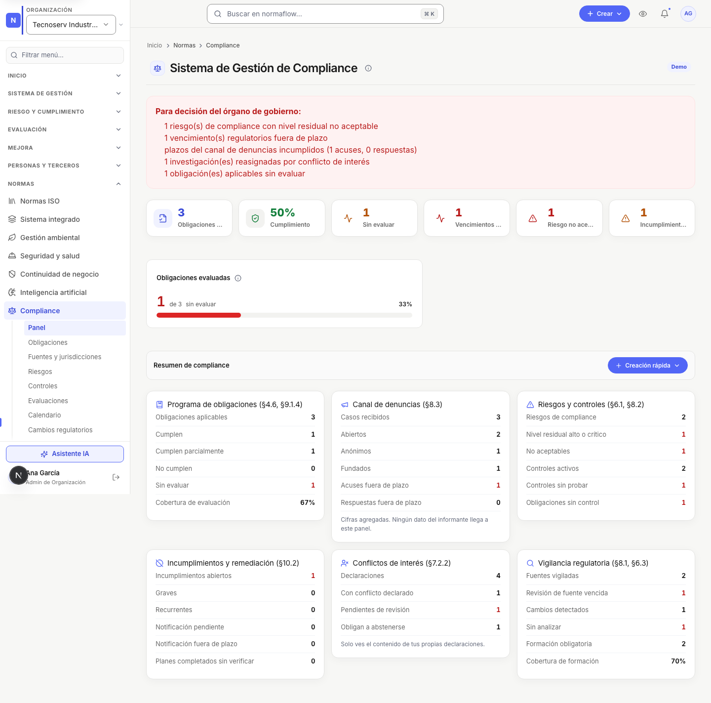

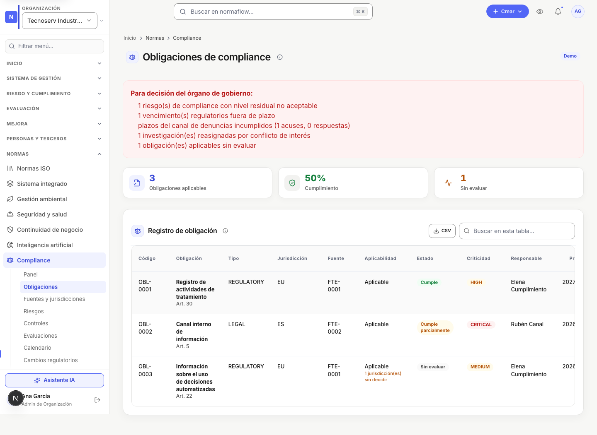

### 12.9. Antisoborno (ISO 37001)

**Ruta:** Normas → Antisoborno

**Secciones:** panel, riesgo de soborno, socios de negocio, debida diligencia, beneficiarios, regalos, donaciones, conflictos, pagos de facilitación, controles, aprobaciones, compromisos e investigaciones.

**Debida diligencia sobre socios de negocio:**

Borrador → Screening → Revisión → Revisión reforzada → Aprobado o rechazado

La revisión reforzada es obligatoria —no opcional— cuando el socio es de riesgo alto o crítico, es una persona políticamente expuesta, es un funcionario público o el screening no sale limpio. Los socios aprobados entran después en revisión periódica.

**Regalos y hospitalidad:**

Presentado → Revisión del responsable → Revisión de compliance → Aprobado o rechazado

Por encima del umbral de la política, o si hay un funcionario público implicado, la revisión de compliance no puede saltarse.

**Operaciones de alto riesgo.** Quien solicita no puede aprobar: el sistema exige aprobación independiente.

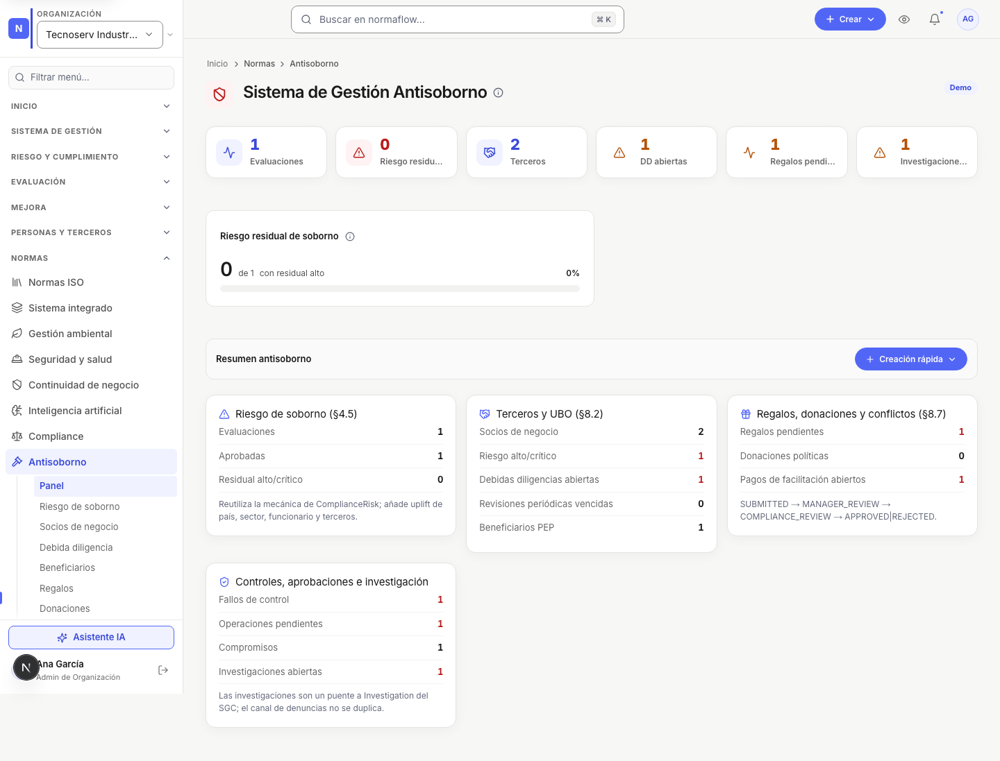

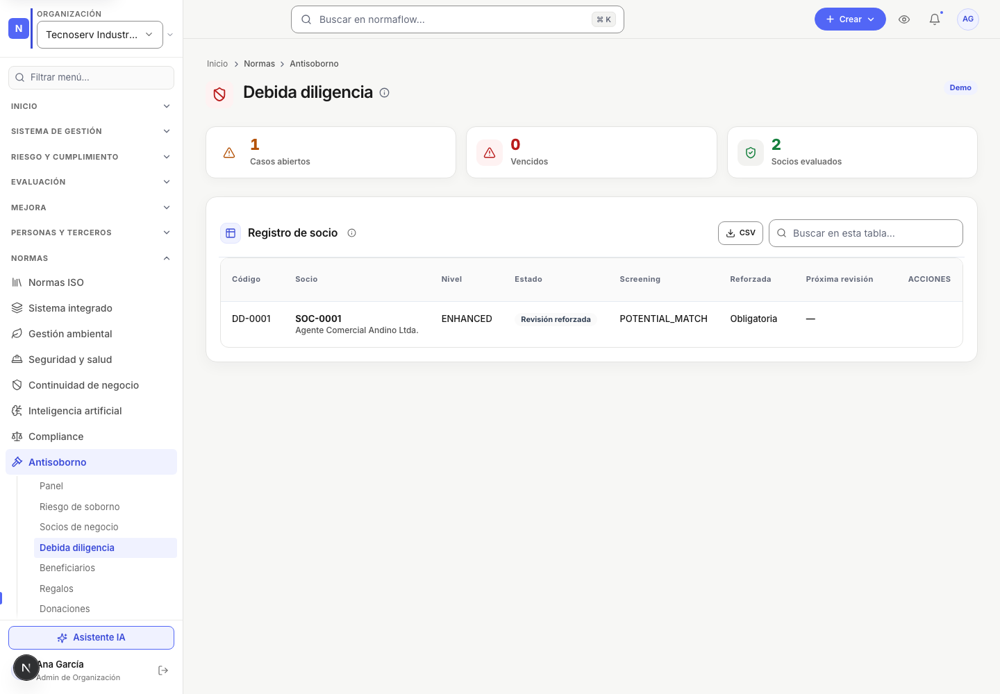

### 12.10. Gestión energética (ISO 50001)

**Ruta:** Normas → Gestión energética

**Secciones:** panel, fuentes y usos, revisión energética, usos significativos, línea base, EnPI, medidores y lecturas, variables y factores, oportunidades, acciones, ahorros, compras y diseño.

**Fórmulas versionadas.** El módulo calcula con fórmulas configurables que quedan registradas con su versión, de modo que un valor histórico siempre puede reproducirse:

| Cálculo | Fórmula |
|---|---|
| Consumo | Suma del periodo |
| Intensidad | Consumo / actividad |
| Comparación con línea base | Actual / base |
| Desviación | (actual − esperado) / esperado |
| Ahorro absoluto | Base − actual |
| Ahorro normalizado | Ahorro tras normalizar por variables |
| Coste | Consumo × coste unitario |
| Emisiones | Consumo × factor de emisión |

Al publicar una versión nueva de una fórmula, la anterior queda marcada como sustituida en lugar de desaparecer.

**Revisión energética:** borrador → en curso → en revisión → aprobada → sustituida.

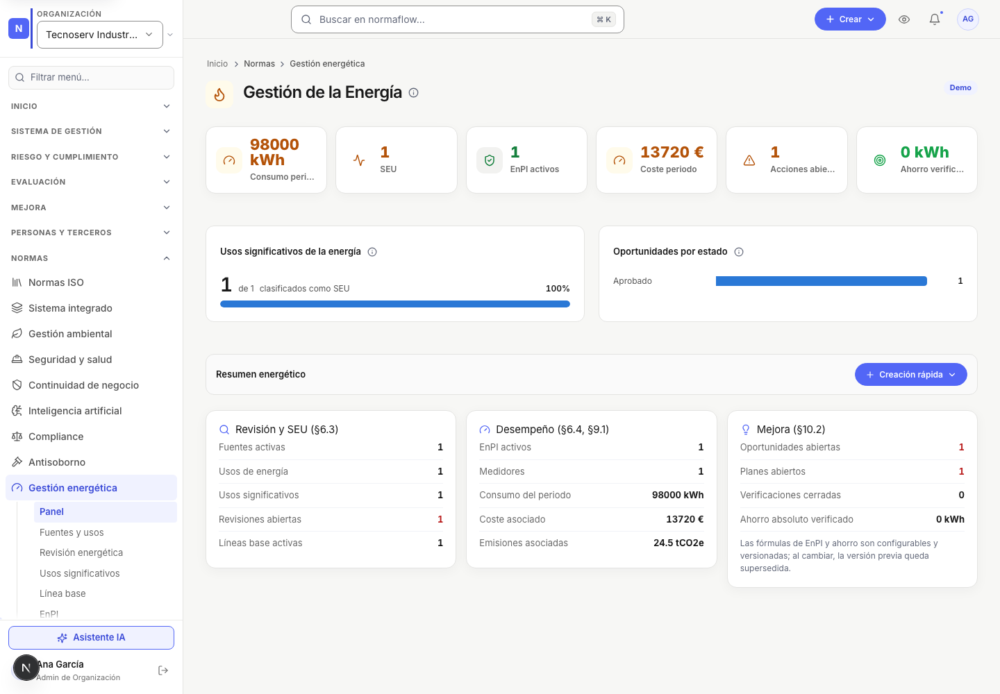

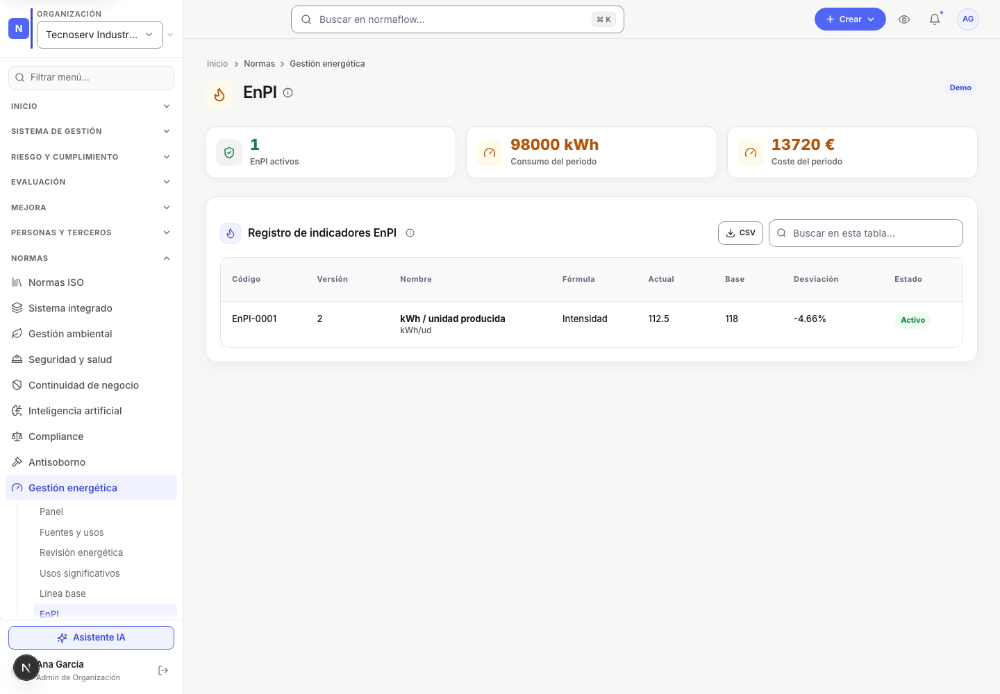

### 12.11. Inocuidad alimentaria (ISO 22000 / HACCP)

**Ruta:** Normas → Inocuidad alimentaria

**Secciones:** panel, productos y materias primas, flujos, peligros, PRP y OPRP, PCC, monitoreo, desviaciones, trazabilidad, retiros, alérgenos, emergencias y comunicación de la cadena.

**Evaluación de peligros.** Puntuación = severidad (1-5) × probabilidad (1-5). Un peligro es significativo a partir de 9 puntos, y la decisión resultante clasifica la medida de control como ninguna, PRP, OPRP o PCC.

**Monitoreo y desviaciones.** Cada límite crítico se define con su operador de comparación. Al registrar un valor de monitoreo fuera de un límite crítico de un PCC, el sistema **abre automáticamente una desviación** y retiene el producto afectado. No depende de que alguien se acuerde de hacerlo.

**Trazabilidad en ambos sentidos.** Los lotes se encadenan a lo largo de la cadena:

proveedor → lote de materia prima → intermedio → producto terminado → cliente o distribución

La prueba de trazabilidad recorre la cadena hacia atrás (de dónde vino) y hacia adelante (a dónde fue), y un retiro expande automáticamente todos los lotes afectados.

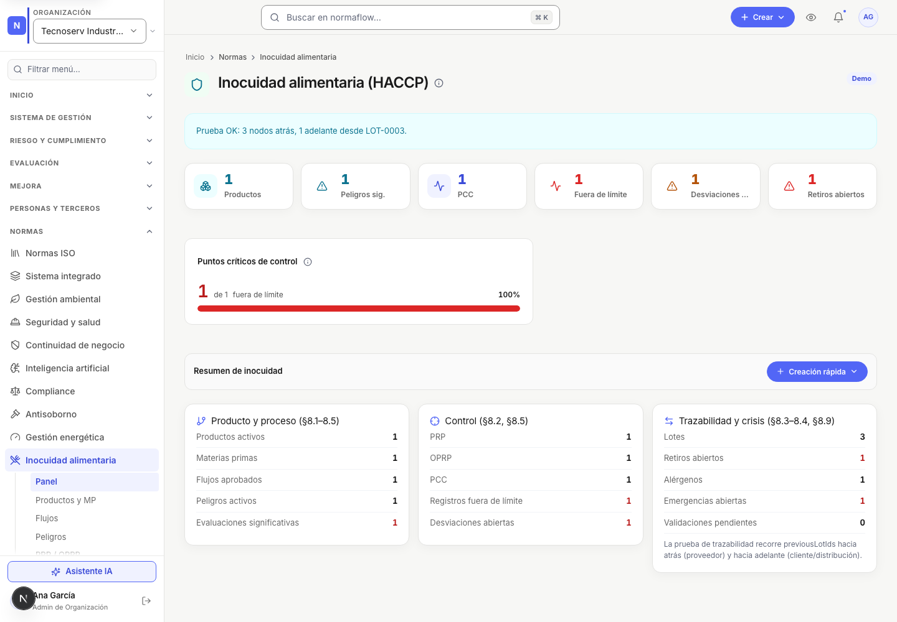

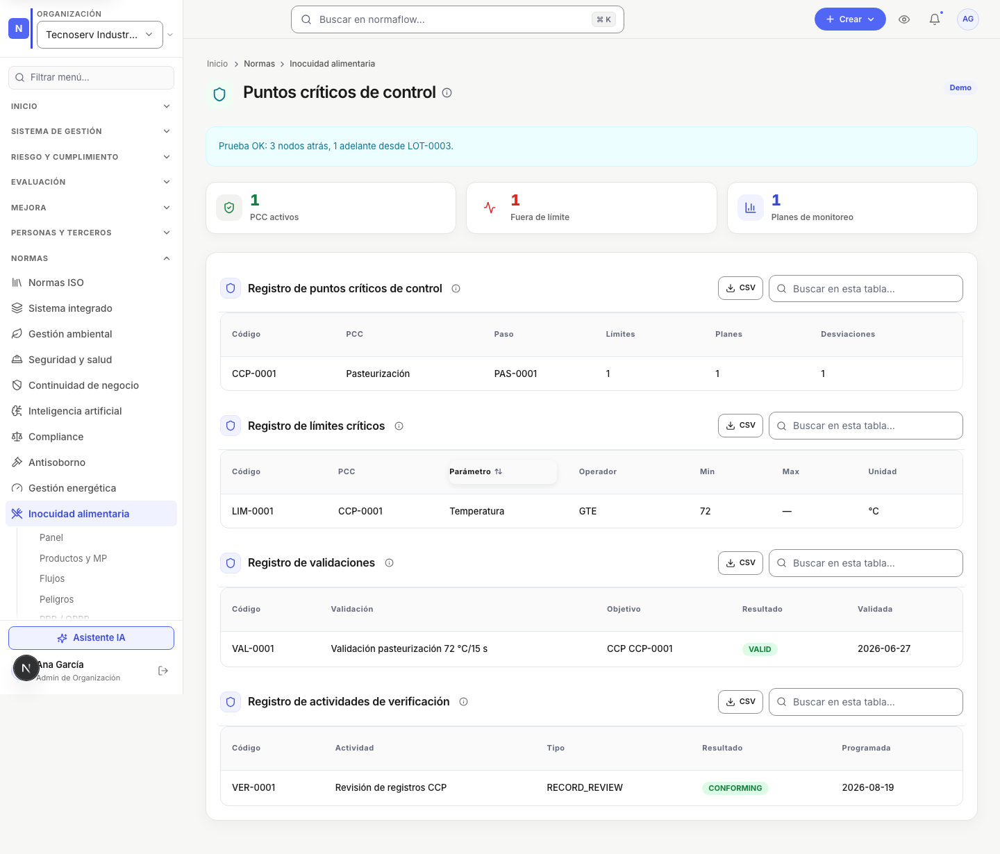

### 12.12. Servicios TI — ITSM (ISO/IEC 20000)

**Ruta:** Normas → Servicios TI (ITSM)

**Secciones:** panel, catálogo de servicios, SLA y OLA, solicitudes, incidentes, problemas, cambios y releases, CMDB, disponibilidad/capacidad/continuidad, proveedores y conocimiento.

**Ciclos de vida cubiertos:**

| Proceso | Flujo |
|---|---|
| Incidente | Nuevo → Asignado → En investigación → Resuelto → Confirmado → Cerrado |
| Problema | Identificado → Análisis → Error conocido → Remediación → Resuelto → Cerrado |
| Cambio | Solicitado → Evaluado → Aprobado → Programado → Implementado → Revisado → Cerrado |
| Solicitud | Nueva → En curso → Atendida → Cerrada |
| Release | Planificada → En construcción → Lista → Liberada, o revertida |
| Despliegue | Pendiente → En curso → Correcto, fallido o revertido |

> Los incidentes de ITSM son un dominio distinto de los incidentes de seguridad de la información del capítulo 8. Se relacionan entre sí, pero no se fusionan: un incidente de servicio no es automáticamente un incidente de seguridad.

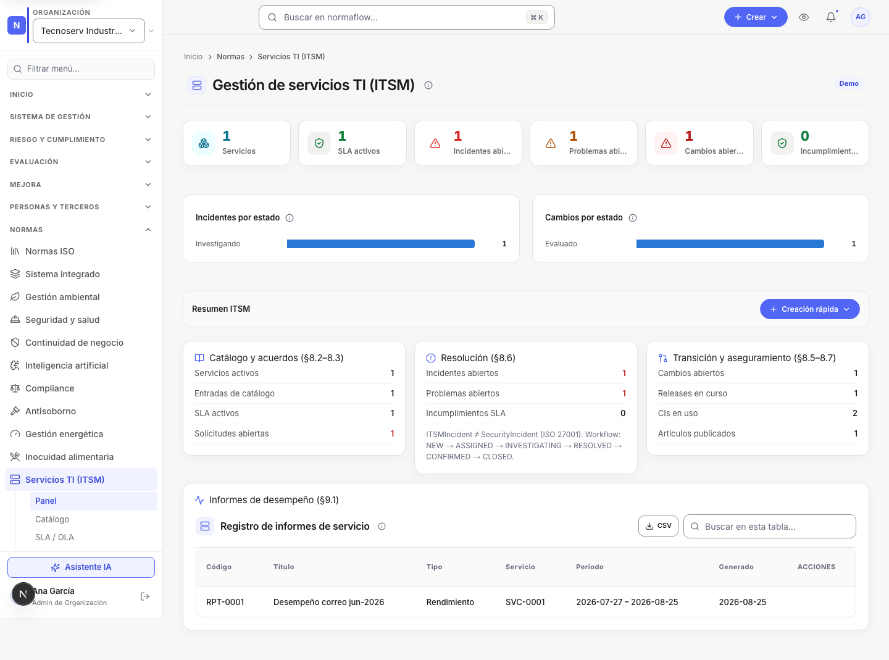

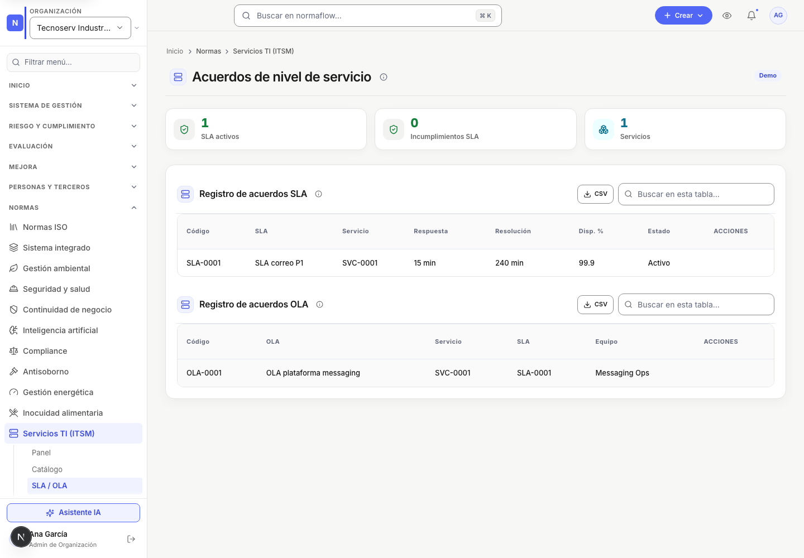

### 12.13. Dispositivos médicos (ISO 13485)

**Ruta:** Normas → Dispositivos médicos

**Secciones:** panel, dispositivos, expediente maestro (DMR), diseño (DHF), riesgos, proveedores, validaciones, lotes y trazabilidad, vigilancia y regulatorio.

**Ciclos de vida cubiertos:**

| Proceso | Flujo |
|---|---|
| DMR / DHF | Borrador → En revisión → Aprobado → Sustituido |
| Queja | Recibida → Triada → En investigación → Vinculada a CAPA → Cerrada |
| Evento adverso | Reportado → En revisión → (Notificado a la autoridad) → Cerrado |
| Vigilancia poscomercialización | Planificada → En curso → (Vencida) → Completada |
| Acción correctiva de campo (FSCA) | Borrador → Iniciada → En curso → Completada → Cerrada |
| Retiro | Borrador → Iniciado → Notificando → En curso → Completado → Cerrado |

**Información sensible.** Quejas, eventos adversos, vigilancia poscomercialización, acciones de campo y retiros contienen datos de pacientes y de incidentes clínicos. Su edición exige un permiso reforzado específico, independiente del permiso general del módulo.

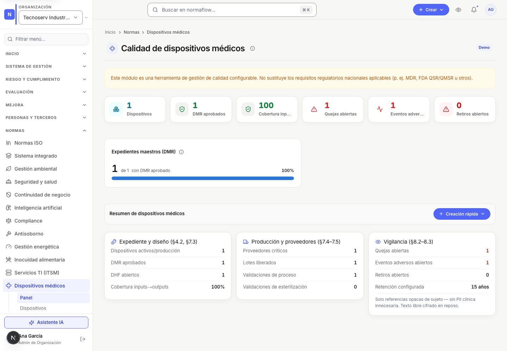

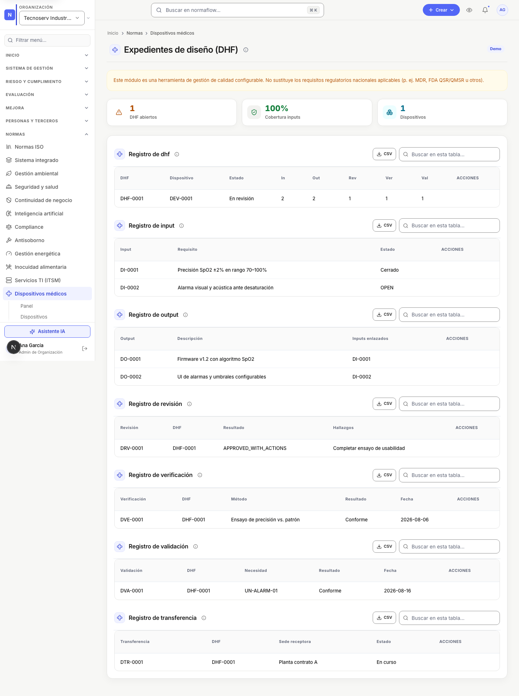

## 13. Administración

### 13.1. Organización

**Ruta:** Administración → Organización

Configura la identidad, los datos de contacto y las **normas activas** de la organización. Es donde se define el alcance del sistema y qué paquetes normativos están instalados.

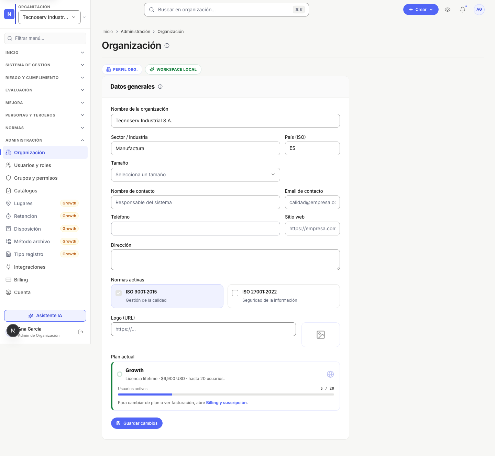

### 13.2. Usuarios y roles

**Ruta:** Administración → Usuarios y roles

Personas con acceso a la organización en NormaFlow. Permite invitar a alguien nuevo, asignarle un rol, revisar su ficha y desactivar cuentas que ya no deban entrar.

**Invitar a una persona:**

1. Pulsa **Invitar persona**.
2. Introduce el correo y el nombre.
3. Selecciona el rol.
4. Envía la invitación.

Conviene distinguir este módulo de **Personal** (capítulo 11): aquí están las cuentas de acceso; allí, la plantilla completa de la organización, entre a NormaFlow o no.

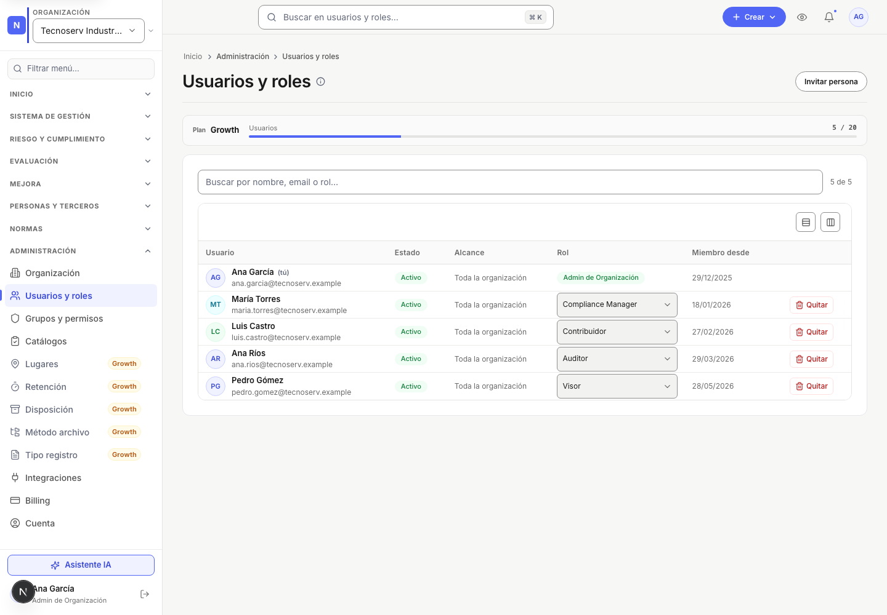

### 13.3. Grupos y permisos

**Ruta:** Administración → Grupos y permisos

Permite delegar permisos adicionales a un equipo **sin subir el rol global** de cada persona. Es la herramienta correcta cuando alguien necesita una capacidad concreta —aprobar documentos de su área, gestionar el módulo ambiental— pero no debe convertirse en administrador de la organización.

**Cómo usarlo:** crea el grupo, describe su finalidad, añade los permisos concretos y asigna a las personas. El permiso efectivo de cada usuario es la suma de su rol y de los grupos a los que pertenece.

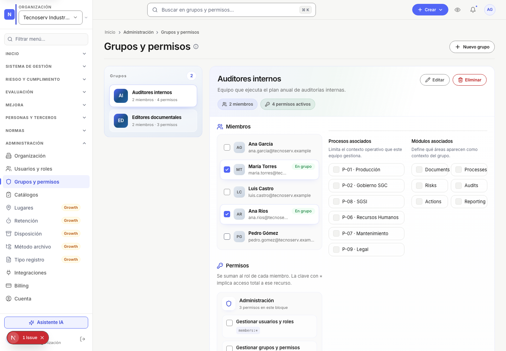

### 13.4. Catálogos base

**Ruta:** Administración → Catálogos

Personaliza los valores que usa la organización en documentos, riesgos, auditorías y evidencias: tipos documentales, categorías de riesgo, orígenes de hallazgo y demás listas desplegables del sistema.

Ajustar estos catálogos al vocabulario real de la organización mejora la adopción y evita que cada persona invente su propia nomenclatura.

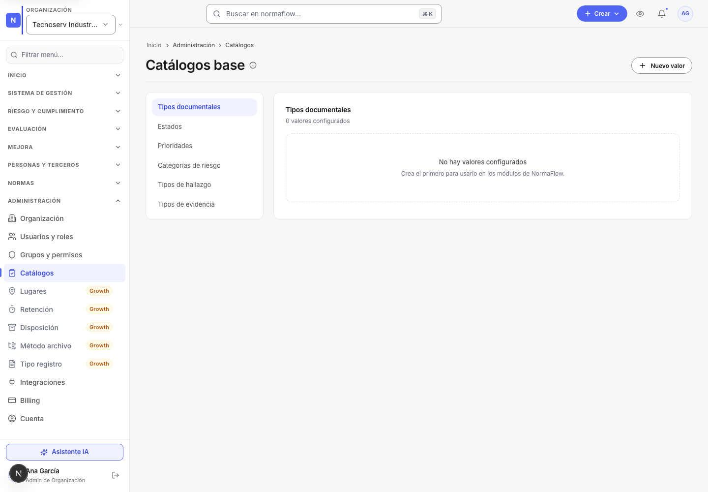

### 13.5. Catálogos de control de registros

El control de registros se apoya en cinco catálogos independientes, cada uno con su pantalla:

| Catálogo | Qué define | Ruta |
|---|---|---|
| **Lugares** | Sedes y ubicaciones desde las que se emiten documentos | Administración → Lugares |
| **Retención** | Plazos durante los que se conserva cada registro antes de su disposición | Administración → Retención |
| **Disposición** | Qué se hace al cumplirse la retención: reciclar, eliminar, archivar | Administración → Disposición |
| **Método archivo** | Cómo se organiza y almacena: archivador físico, carpeta compartida, repositorio cifrado | Administración → Método archivo |
| **Tipo registro** | Categoría genérica: físico, electrónico, mixto | Administración → Tipo registro |

Conviene definirlos **antes** de dar de alta registros: son los valores que el módulo de Registros ofrece al clasificar cada uno.

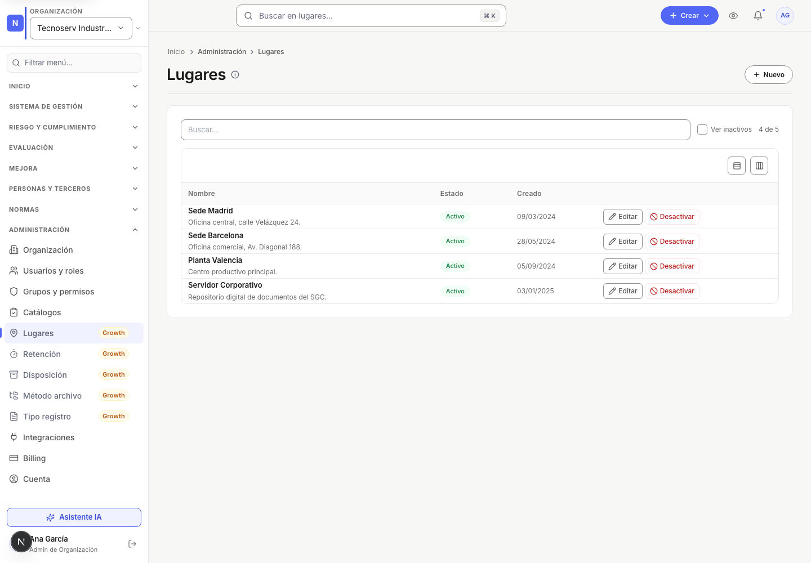

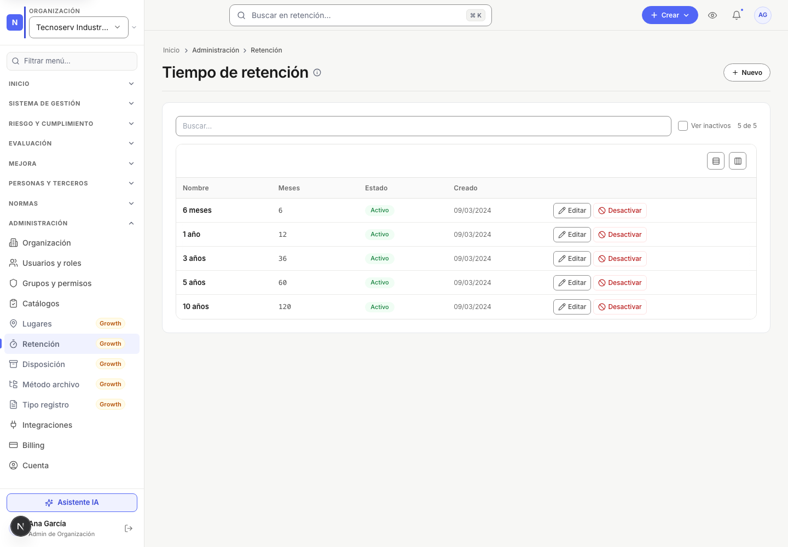

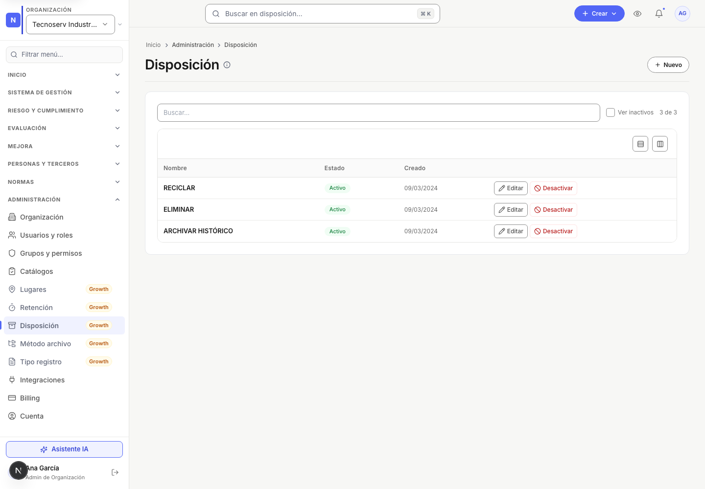

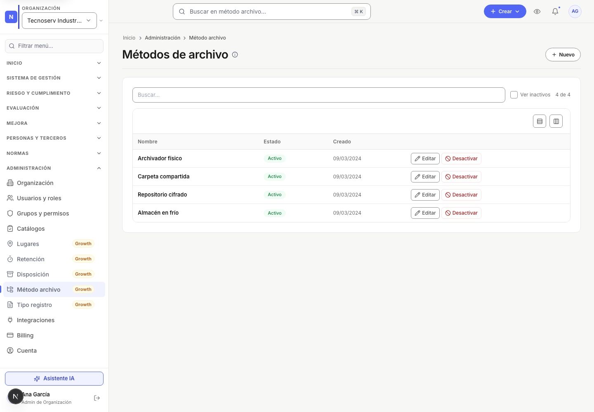

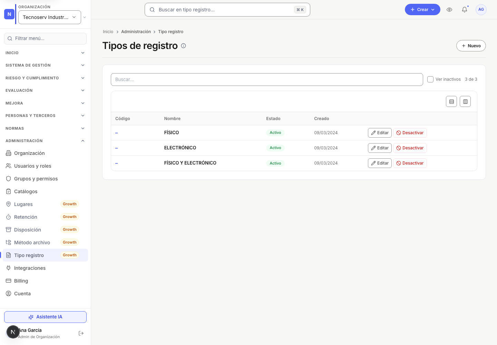

### 13.6. Integraciones

**Ruta:** Administración → Integraciones

Catálogo de conectores para evidencias, identidad y operación. El estado de cada conector y su configuración se consultan desde esta pantalla.

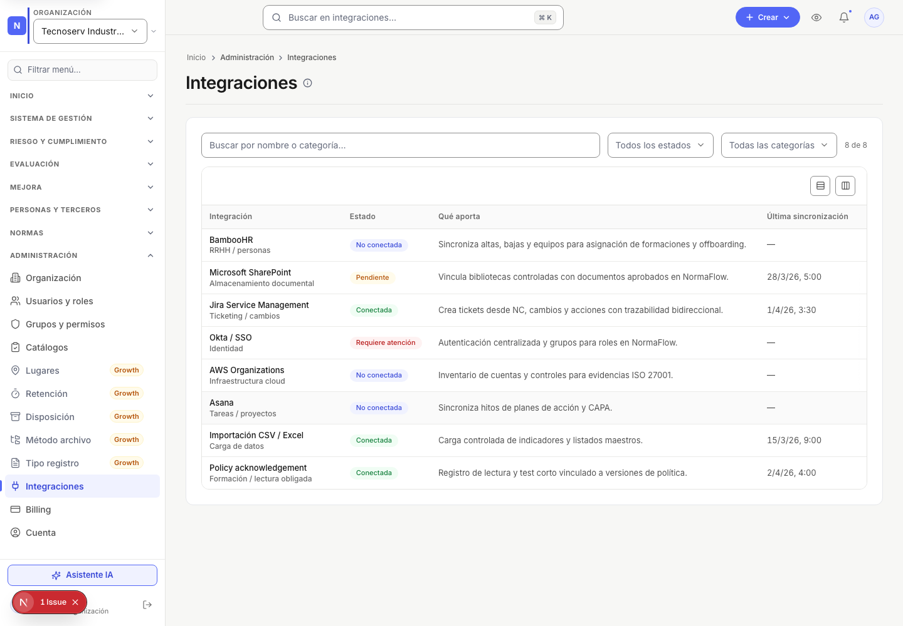

### 13.7. Billing y suscripción

**Ruta:** Administración → Billing

Muestra el plan de la organización, los límites y el consumo, y las facturas disponibles. El plan determina qué módulos normativos están accesibles: los que quedan fuera aparecen bloqueados en el menú con la indicación del plan necesario.

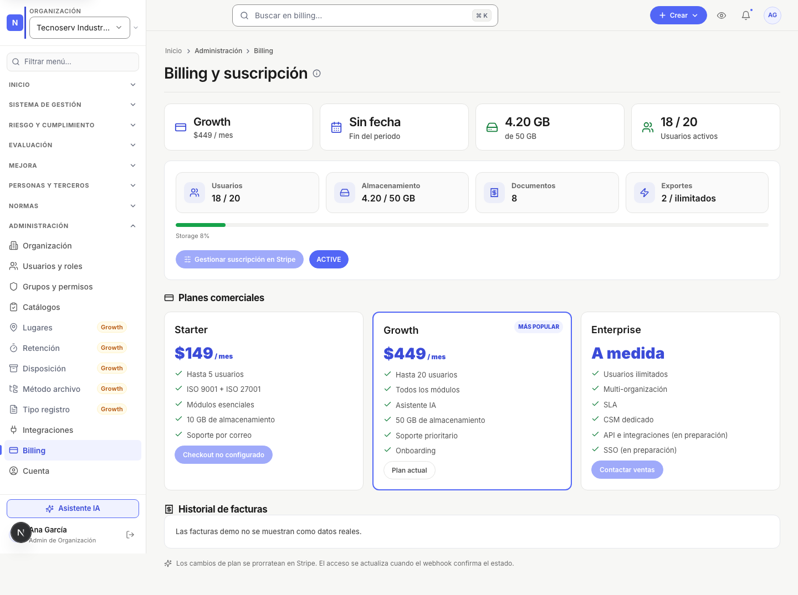

### 13.8. Cuenta y perfil

**Ruta:** Administración → Cuenta

Datos del perfil, organización visible, rol, idioma y preferencias de sesión. Desde el menú de usuario también se cierra la sesión.

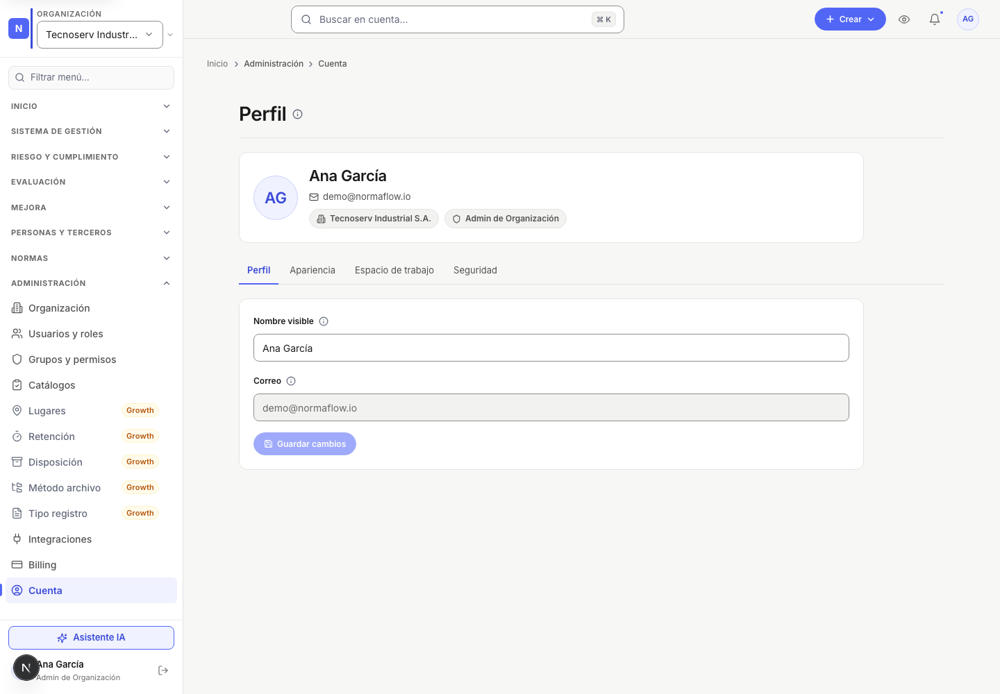

## 14. Roles y permisos

### 14.1. Roles disponibles

| Rol | Uso habitual |
|---|---|
| **Super Admin** | Administración global de la plataforma. |
| **Owner / Admin de organización** | Control total de la organización: configuración, usuarios, facturación y todos los módulos. |
| **Manager** | Gestión operativa amplia del sistema, sin administración de la organización ni facturación. |
| **Compliance Manager** | Gestión diaria del sistema: documentos, GAP, riesgos, auditorías, acciones y módulos normativos. |
| **Auditor** | Planificación y ejecución de auditorías, checklists, hallazgos y exportaciones. Lectura del resto del sistema; puede crear no conformidades pero no cerrarlas. |
| **Contribuidor** | Carga información operativa —documentos, riesgos, evidencias, registros, indicadores— en los módulos del núcleo. No accede a los módulos normativos especializados ni a la administración. |
| **Visor** | Consulta e informes, sin capacidad de modificación. |

### 14.2. Cómo se conceden los permisos

Un permiso se expresa como **módulo : acción**. Las acciones posibles son consultar el directorio, ver, crear, actualizar, aprobar, eliminar y exportar.

Ese detalle importa en la práctica. Por ejemplo, el rol auditor recibe el **directorio** de personas —los nombres necesarios para asignar trabajo— pero no la ficha completa con los datos de contacto: leer un nombre y administrar la plantilla no son la misma concesión.

El permiso efectivo de una persona es la suma de:

1. los permisos de su **rol**;
2. los permisos de los **grupos** a los que pertenece;
3. limitados por los **módulos que incluye el plan** contratado.

### 14.3. Módulos con protección reforzada

Tres conjuntos de datos tienen permisos propios, separados del permiso general de su módulo, porque contienen información especialmente sensible:

| Datos | Protección |
|---|---|
| **Vigilancia de la salud** (ISO 45001) | Información médica de trabajadores identificados. Nunca accesible a contribuidores ni visores; el auditor solo puede consultarla y exportarla. |
| **Canal de denuncias** (ISO 37301) | Módulo de permisos independiente de compliance, con acceso concedido caso a caso. Gestionar el programa de cumplimiento no da acceso a las denuncias. |
| **Vigilancia de dispositivos** (ISO 13485) | Quejas, eventos adversos, acciones de campo y retiros exigen un permiso reforzado adicional para su edición. |

> Al conceder permisos, parte del rol más bajo que permita hacer el trabajo y añade grupos para las capacidades concretas que falten. Es más fácil de justificar en auditoría que un reparto generoso de roles administradores.

## 15. Buenas prácticas de uso

- Define códigos únicos para documentos, registros, riesgos, acciones y auditorías.
- Mantén un responsable y una fecha objetivo en cada elemento abierto.
- No cierres una acción sin evidencia de ejecución y verificación de eficacia.
- Relaciona documentos, procesos, riesgos, indicadores y evidencias: la trazabilidad es lo que un auditor comprueba primero.
- En sistemas multinorma, consulta la matriz de correspondencia antes de crear documentación nueva. Un documento compartido es mejor que tres documentos paralelos.
- Configura los catálogos —incluidos los cinco de registros— antes de la carga masiva de datos.
- Versiona las metodologías de valoración (significancia ambiental, riesgo laboral, fórmulas energéticas) en vez de editarlas: el histórico debe seguir siendo reproducible.
- Revisa notificaciones y vencimientos con una frecuencia fija, no cuando se acerca la auditoría.
- Usa la revisión por la dirección para consolidar decisiones, y las acciones que salen de ella para demostrar seguimiento.
- Concede el permiso mínimo necesario y apóyate en grupos antes que en subir roles.
- Separa el uso demo del uso live y no cargues información real en la cuenta de demostración.

## 16. Solución de problemas frecuentes

### No puedo entrar

Comprueba la URL, el correo y la contraseña. En demo, usa exactamente las credenciales del capítulo 3. En live, confirma que la invitación se ha aceptado y que la cuenta sigue activa.

### No veo un módulo en el menú

Hay tres motivos posibles, en este orden: el **plan** no lo incluye (aparecería bloqueado con la indicación del plan), tu **rol** no tiene permiso sobre él (no aparece), o la **norma** no está activa en la organización. Revisa Billing, Grupos y permisos, y Normas ISO.

### No veo un botón dentro de un módulo

Depende del permiso concreto —crear, actualizar, aprobar— o del estado del registro. Pide al administrador que revise tu rol y los grupos a los que perteneces.

### Una pantalla aparece vacía

Comprueba que estás en la organización correcta, recarga la página y revisa si la sesión expiró. Si el módulo es de una norma, confirma que la norma está activa y que sus datos se han cargado.

### No se puede cerrar un registro

Muchos flujos tienen cierre condicionado y lo impiden a propósito. Un incidente de seguridad y salud no se cierra sin recorrer las siete etapas de investigación; una no conformidad necesita verificación de eficacia; un plan de continuidad solo se activa si está aprobado. Revisa qué etapa falta en vez de forzar el estado.

### El RTO no se guarda

En continuidad, el RTO nunca puede superar el MTPD de la actividad. Corrige uno de los dos valores.

### Cambié la metodología de valoración y los resultados antiguos no cuadran

Es el comportamiento esperado: las metodologías se versionan y los valores históricos conservan el método con el que se calcularon. Si quieres homogeneizar, recalcula los impactos contra el método activo desde el propio módulo.

### La sugerencia de IA no responde

Revisa que el entorno tenga configurada una clave válida del proveedor de IA y que haya conectividad. La IA es un apoyo opcional: el resto del sistema funciona sin ella.

## 17. Checklist rápido para una auditoría

- [ ] Alcance, contexto y normas activas definidos.
- [ ] Partes interesadas y objetivos registrados y vigentes.
- [ ] GAP contestado y brechas priorizadas por norma.
- [ ] Mapa de procesos actualizado con responsables.
- [ ] Documentos vigentes, aprobados y versionados.
- [ ] Registros con retención, disposición y método de archivo definidos.
- [ ] Riesgos evaluados, tratados y con riesgo residual documentado.
- [ ] Declaración de Aplicabilidad vigente y justificada (ISO 27001).
- [ ] Datos específicos de cada norma activa completos y actualizados.
- [ ] Indicadores con valores recientes y análisis de desviaciones.
- [ ] Evidencias enlazadas al requisito que satisfacen.
- [ ] Programa anual y auditorías ejecutadas registradas.
- [ ] No conformidades con causa raíz, acción y eficacia verificada.
- [ ] Revisión por la dirección documentada con sus acciones.
- [ ] Matriz de correspondencia revisada si hay varias normas.
- [ ] Informe o paquete de auditoría generado.
- [ ] Actividad y trazabilidad revisadas.

## 18. Referencia técnica del producto

NormaFlow está construido con Next.js, React, Tailwind CSS, Prisma y Supabase. La autenticación live usa Supabase Auth; el modo demo utiliza una sesión local para facilitar pruebas y demostraciones. El almacenamiento, la facturación, el correo y la IA dependen de las variables y servicios configurados en cada entorno.

El aislamiento entre organizaciones se aplica en la base de datos, no solo en la aplicación: cada tabla lleva políticas de acceso por organización, y los flujos con cierre condicionado —investigación de incidentes, permisos de trabajo— se refuerzan además con restricciones en el propio motor de base de datos, de modo que no puedan saltarse por una vía alternativa.

Este manual describe la interfaz y los flujos visibles en la versión documentada. Conviene actualizarlo cuando cambien rutas, permisos, formularios, normas disponibles o estados de los módulos.

### Cómo regenerar este manual

Las capturas y el PDF se generan desde el repositorio:

1. Levanta la aplicación en modo demo.
2. Ejecuta el script de capturas, que recorre todos los módulos y guarda las imágenes en `docs/manual/screenshots`.
3. Ejecuta el script de construcción, que produce el HTML y el PDF a partir de este archivo Markdown.

Los tres artefactos —Markdown, HTML y PDF— viven en `docs/` y deben regenerarse juntos.
