# Manual de usuario de NormaFlow

**Plataforma de gestión ISO 9001 e ISO 27001**  
**Versión del manual:** 1.0 · **Fecha:** 19 de julio de 2026

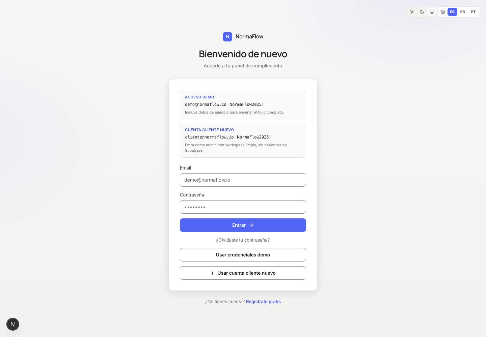

## 1. ¿Qué es NormaFlow?

NormaFlow es una aplicación web para organizar, operar y demostrar un sistema de gestión. Centraliza en un mismo espacio el diagnóstico de cumplimiento, los documentos, los riesgos, las auditorías, las no conformidades, las acciones de mejora, los indicadores y las evidencias.

La plataforma está orientada principalmente a organizaciones que trabajan con:

- **ISO 9001:2015**, para gestión de la calidad.
- **ISO 27001:2022**, para gestión de la seguridad de la información.

El objetivo es que el equipo pueda pasar de la evaluación a la acción y conservar la trazabilidad necesaria para revisiones internas, comités y auditorías externas.

### 1.1. Qué se puede hacer con la plataforma

1. Evaluar el nivel de cumplimiento por norma y cláusula.
2. Crear, versionar, revisar y aprobar documentos del sistema de gestión.
3. Registrar riesgos, valorar probabilidad e impacto y definir tratamientos.
4. Planificar auditorías, usar checklists y registrar hallazgos.
5. Gestionar no conformidades y acciones correctivas (CAPA).
6. Medir indicadores y adjuntar evidencias.
7. Administrar procesos, proveedores, capacitación y cambios.
8. Preparar informes y paquetes de auditoría.
9. Consultar actividad, notificaciones, cuenta, suscripción e integraciones.

### 1.2. Nota sobre las capturas y el modo demo

Las capturas de este manual se tomaron con la sesión demo local de NormaFlow, usando datos de ejemplo de **Tecnoserv Industrial S.A.** Sirven para explicar la interfaz y el flujo de trabajo; no deben interpretarse como datos reales de una organización.

En modo demo, el espacio se carga con datos de muestra y las operaciones se mantienen dentro de la sesión de demostración. En una instalación live, la persistencia y los permisos dependen de la configuración de Supabase, del rol de usuario y de los módulos habilitados.

## 2. Acceso al sistema

### 2.1. Entrar con la cuenta demo

1. Abre la URL de NormaFlow.
2. En la pantalla de acceso, pulsa **Usar credenciales demo** o escribe los datos:
   - **Correo:** demo@normaflow.io
   - **Contraseña:** NormaFlow2025!
3. Pulsa **Entrar**.
4. El sistema te llevará al **Dashboard**.

También existe una cuenta de cliente nuevo para probar un workspace vacío:

- **Correo:** cliente@normaflow.io
- **Contraseña:** NormaFlow2025!

### 2.2. Recuperar la contraseña

Desde la pantalla de login, selecciona **¿Olvidaste tu contraseña?** y sigue el formulario. En un entorno live, el enlace y el envío dependen de la configuración de autenticación y correo.

### 2.3. Crear una organización

El registro de una cuenta nueva inicia el onboarding. El usuario debe indicar el nombre de la organización y seleccionar al menos una norma. Después se crea el workspace y se accede al dashboard.

## 3. Orientación por la interfaz

### 3.1. Barra lateral

La barra lateral es el menú principal. Desde ella se accede a todos los módulos, al selector de organización y al perfil. La opción activa aparece resaltada.

### 3.2. Barra superior

En la parte superior se encuentran:

- búsqueda contextual;
- selector de idioma **ES / EN / PT**;
- menú **Crear** para iniciar registros;
- accesos rápidos de vista, notificaciones y perfil.

### 3.3. Selector de organización

Si el usuario pertenece a más de una organización, puede cambiar de workspace desde el selector situado bajo la marca. Los datos, permisos y módulos visibles pueden variar por organización.

### 3.4. Dashboard

El Dashboard ofrece una vista de control del sistema:

- cumplimiento global y tendencia;
- puntuación por norma;
- alertas críticas;
- documentos pendientes;
- acciones activas;
- auditorías planificadas;
- actividad reciente;
- accesos rápidos a GAP, auditorías, riesgos y plan de acción.

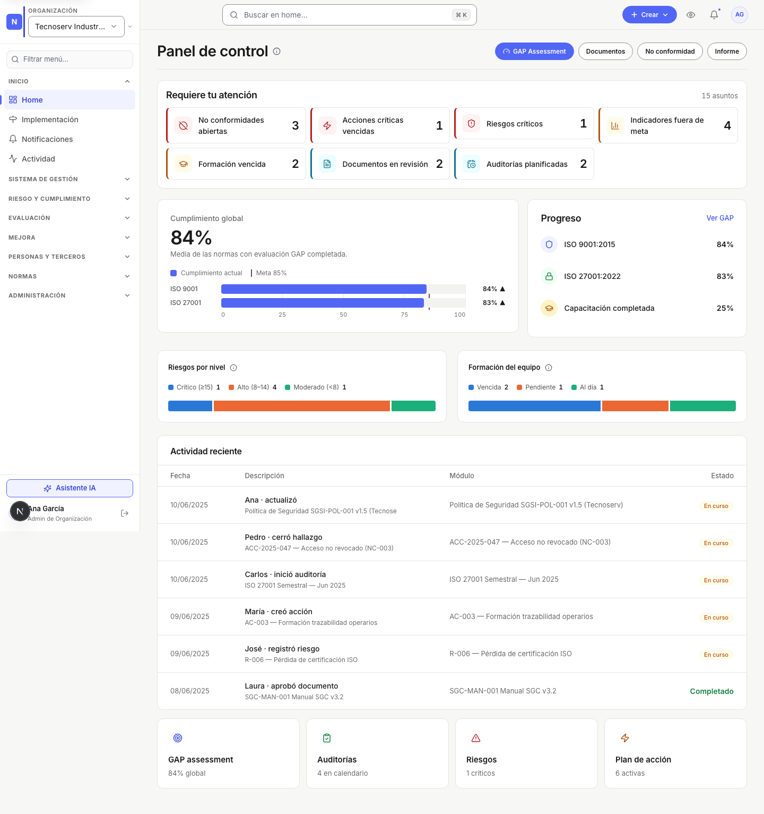

## 4. Flujo recomendado de trabajo

Para implantar y mantener un sistema de gestión, se recomienda seguir este orden:

1. **Implementación guiada:** completar la base organizativa, normas y preparación inicial.
2. **GAP Assessment:** medir la situación actual por cláusula.
3. **Procesos:** definir el mapa de procesos y sus responsables.
4. **Documentos:** crear o cargar procedimientos, políticas, manuales y formularios.
5. **Riesgos:** registrar riesgos y definir controles o tratamientos.
6. **Indicadores y evidencias:** establecer cómo se medirá cada proceso y conservar pruebas.
7. **Auditorías:** planificar auditorías y registrar sus resultados.
8. **No conformidades y acciones:** corregir desviaciones y verificar la eficacia.
9. **Revisión por la dirección:** consolidar entradas, decisiones y acciones.
10. **Informes y audit trail:** preparar la evidencia final para comité o auditor externo.

## 5. Módulos y funciones

### 5.1. Implementación guiada

**Ruta:** Implementación

Es el checklist de preparación del sistema. Ayuda a avanzar por bloques como base organizativa, alcance, procesos, documentación, riesgos y evidencias.

**Cómo usarlo:**

1. Abre **Implementación**.
2. Revisa los bloques pendientes.
3. Entra en el módulo sugerido por cada bloque.
4. Completa los datos y vuelve a la guía para comprobar el avance.

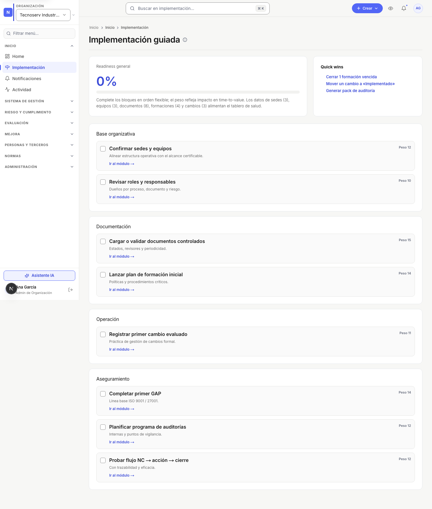

### 5.2. GAP Assessment

**Ruta:** GAP Assessment

Permite evaluar el cumplimiento de cada cláusula de la norma seleccionada. Cada cláusula muestra un porcentaje, estado y número de respuestas.

**Funciones principales:**

- cambiar entre **ISO 9001:2015** e **ISO 27001:2022**;
- abrir una cláusula y editar sus respuestas;
- consultar cumplimiento global;
- distinguir conforme, parcialmente conforme y no conforme;
- ver recomendaciones de mejora;
- exportar el informe en PDF;
- solicitar una sugerencia de IA para convertir brechas en un plan de acción.

**Uso recomendado:** responde primero las cláusulas con evidencia disponible, documenta las brechas y prioriza las áreas con menor puntuación.

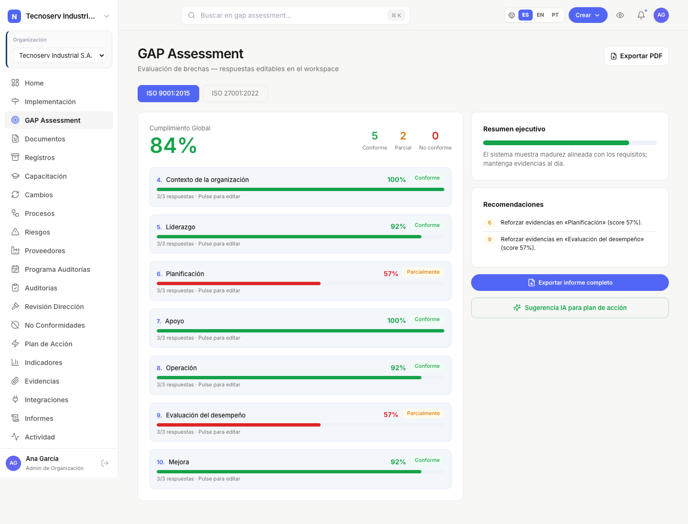

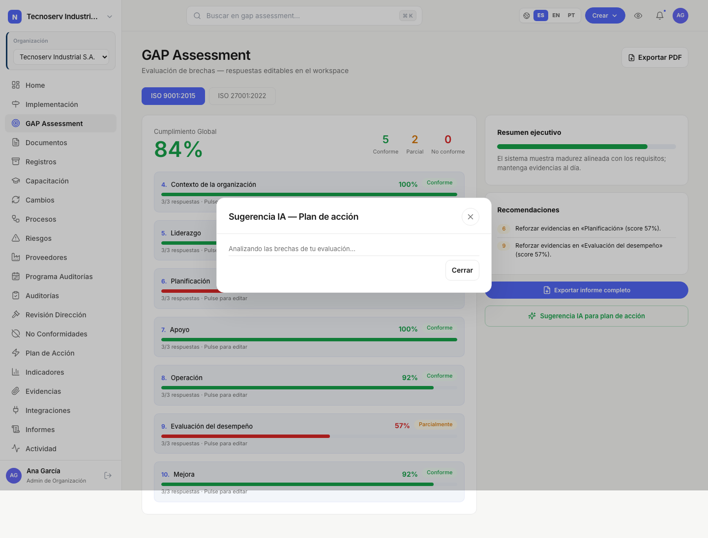

> La IA es un apoyo de análisis. Las recomendaciones deben ser revisadas y aprobadas por una persona responsable antes de convertirse en acciones oficiales.

Si el panel queda en estado de análisis o devuelve un error, revisa que el entorno tenga configurada una clave válida de Anthropic y que el servicio tenga conectividad.

### 5.3. Control de Documentos

**Ruta:** Documentos

Es el repositorio controlado para políticas, manuales, procedimientos, instrucciones, formularios y planes.

**Qué permite hacer:**

- buscar por título o código;
- ordenar y filtrar por carpeta y estado;
- distinguir aprobados, en revisión, borradores y obsoletos;
- crear documentos con título, código, tipo, norma, cláusula y proceso asociado;
- adjuntar un archivo para vista previa;
- revisar historial y versiones;
- aprobar o marcar como obsoleto cuando el rol lo permita.

**Crear un documento:**

1. Pulsa **Nuevo documento**.
2. Introduce título y código.
3. Selecciona el tipo documental.
4. Añade norma, cláusula y proceso asociado.
5. Adjunta el archivo opcional.
6. Pulsa **Crear Documento**.

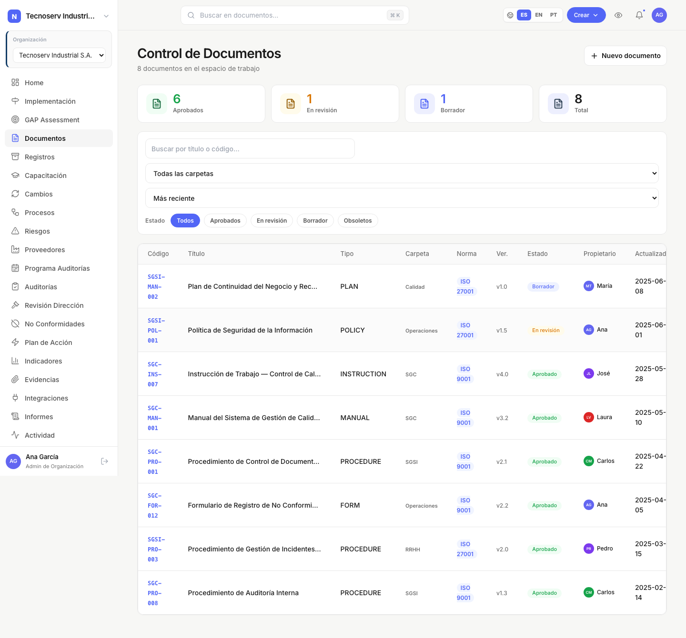

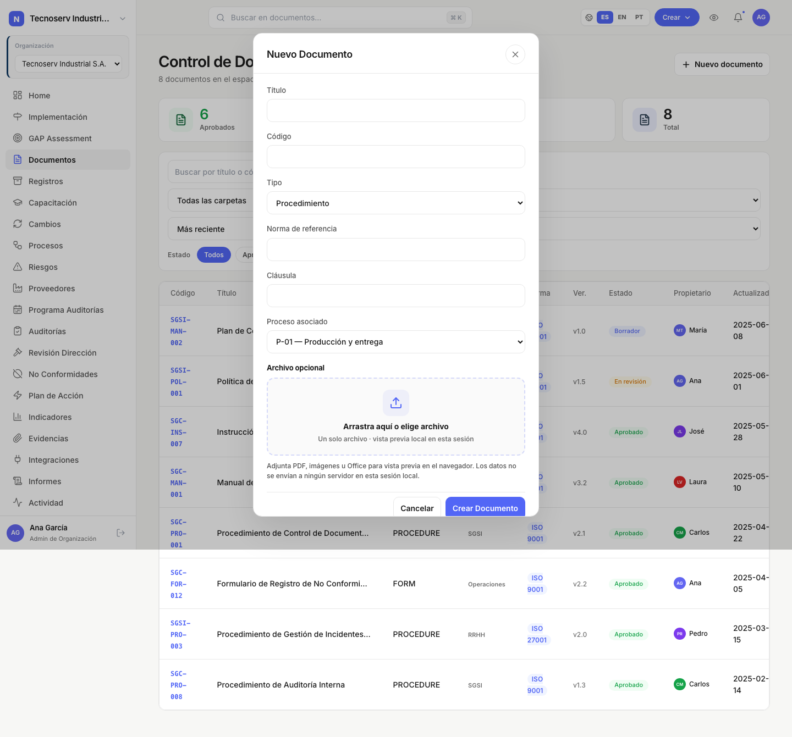

### 5.4. Control de Registros

**Ruta:** Registros

Controla registros y entradas que deben conservarse como evidencia del sistema. El módulo se relaciona con tipos de registro, retención, disposición, método de archivo y custodia.

**Flujo:**

1. Define o selecciona el tipo de registro.
2. Indica responsable, ubicación y periodo de retención.
3. Registra cada entrada o evidencia.
4. Revisa cuándo corresponde conservar, disponer o archivar.

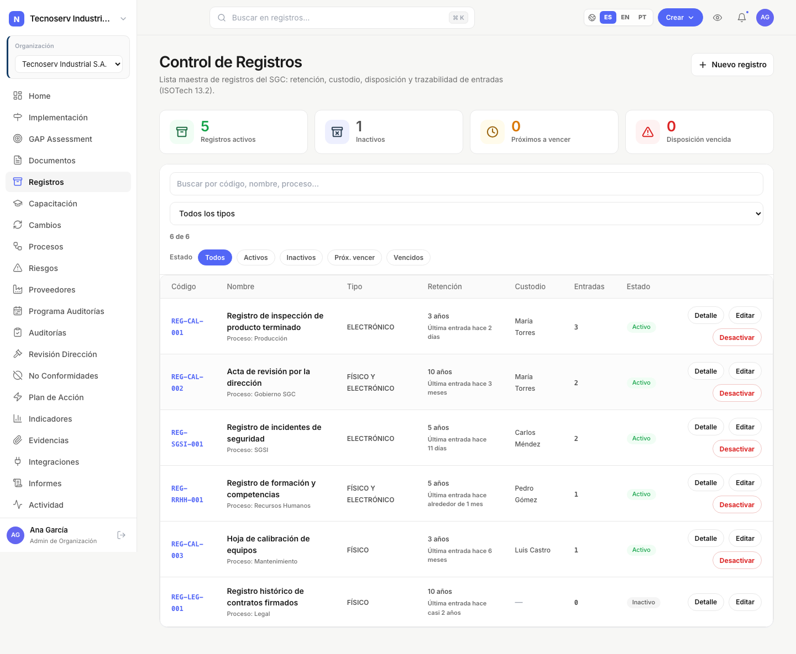

### 5.5. Gestión de Procesos

**Ruta:** Procesos

Permite representar el mapa de procesos y relacionar cada proceso con responsables, riesgos, indicadores, documentos y evidencias.

**Operaciones:**

- crear un proceso;
- editar nombre, código y descripción;
- asignar responsable;
- definir entradas, salidas y objetivos;
- enlazar documentos, riesgos e indicadores;
- consultar el detalle del proceso.

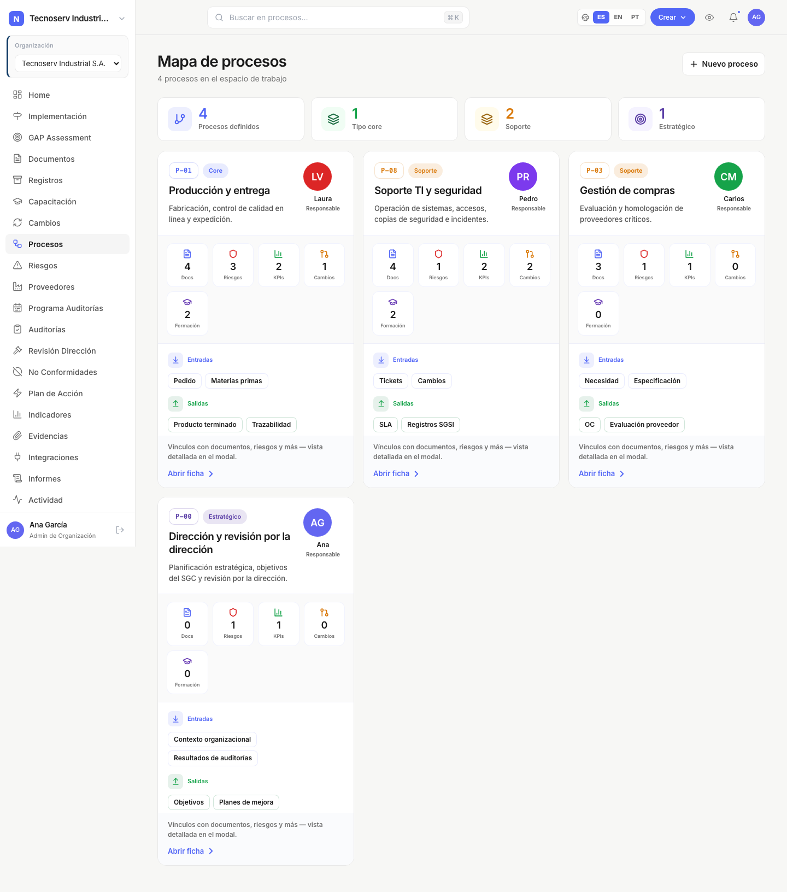

### 5.6. Gestión de Riesgos

**Ruta:** Riesgos

Es el registro para identificar, valorar y tratar riesgos. La pantalla combina un mapa de calor 5×5 con el registro detallado.

**Registrar un riesgo:**

1. Pulsa **Nuevo Riesgo**.
2. Introduce el título y la categoría.
3. Asigna responsable y proceso asociado.
4. Valora **probabilidad** e **impacto** de 1 a 5.
5. Define vencimiento, control, estado y tratamiento.
6. Pulsa **Guardar**.

El score se calcula con la combinación de probabilidad e impacto. El sistema separa riesgos críticos, altos y moderados para facilitar la priorización.

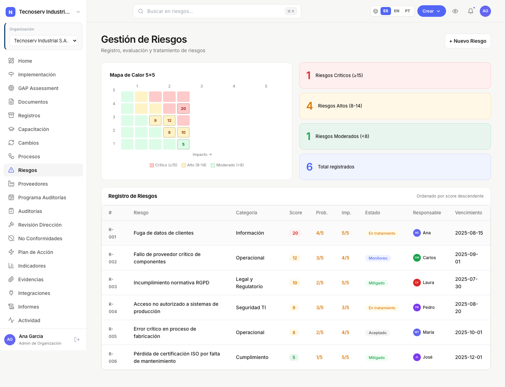

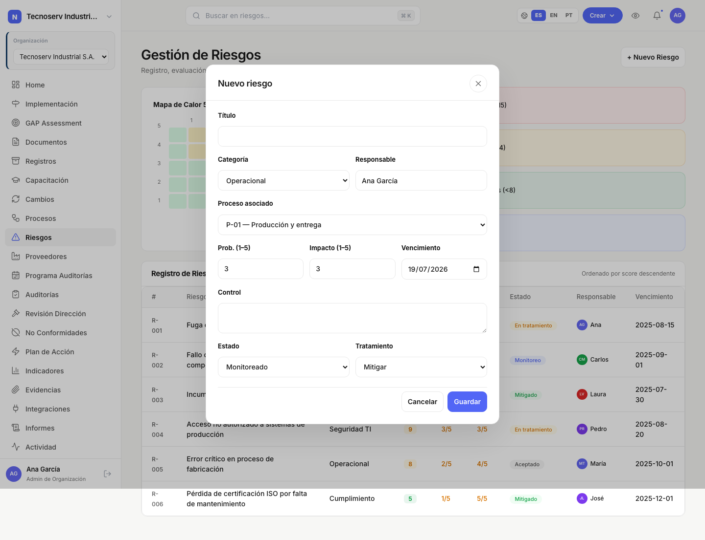

### 5.7. Proveedores y contratistas

**Ruta:** Proveedores

Centraliza la evaluación de proveedores: criticidad, revisiones, riesgos, documentos y evidencias asociadas.

**Uso recomendado:** clasifica primero la criticidad, asigna responsable de revisión y conserva las evidencias de homologación o seguimiento.

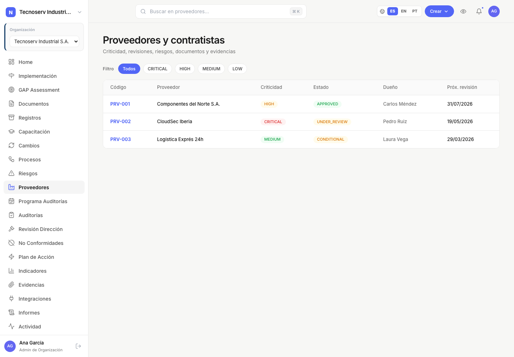

### 5.8. Control de Cambios

**Ruta:** Cambios

Registra solicitudes de cambio y muestra su flujo de estados. Sirve para valorar impacto, aprobar el cambio, documentar la implementación y cerrar la solicitud.

**Flujo general:** solicitud → análisis → aprobación → implementación → verificación → cierre.

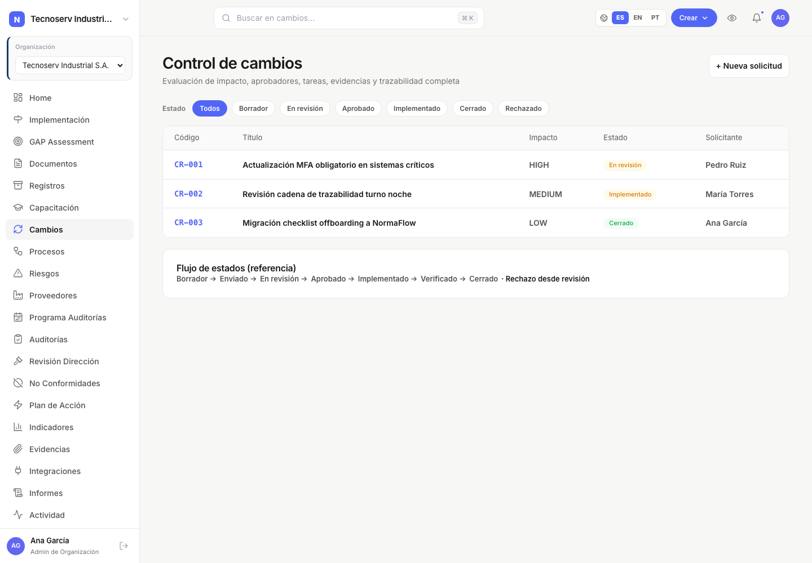

### 5.9. Programa anual de auditorías

**Ruta:** Programa Auditorías

Permite definir el programa anual, su objetivo, alcance, normas, periodos y auditorías previstas. Es la vista de planificación de alto nivel.

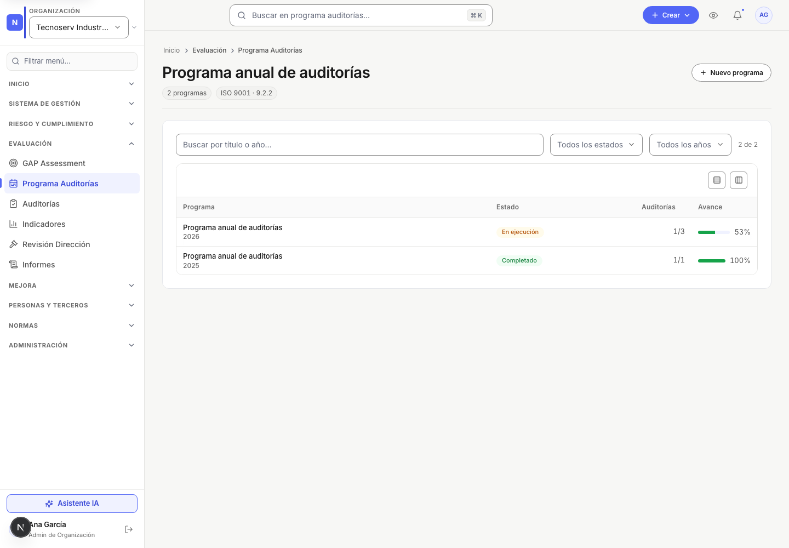

### 5.10. Auditorías

**Ruta:** Auditorías

Gestiona la ejecución de auditorías individuales.

**Funciones:**

- crear auditoría y definir alcance;
- indicar fecha, auditor y norma;
- usar checklist;
- registrar hallazgos;
- relacionar no conformidades;
- cerrar formalmente la auditoría.

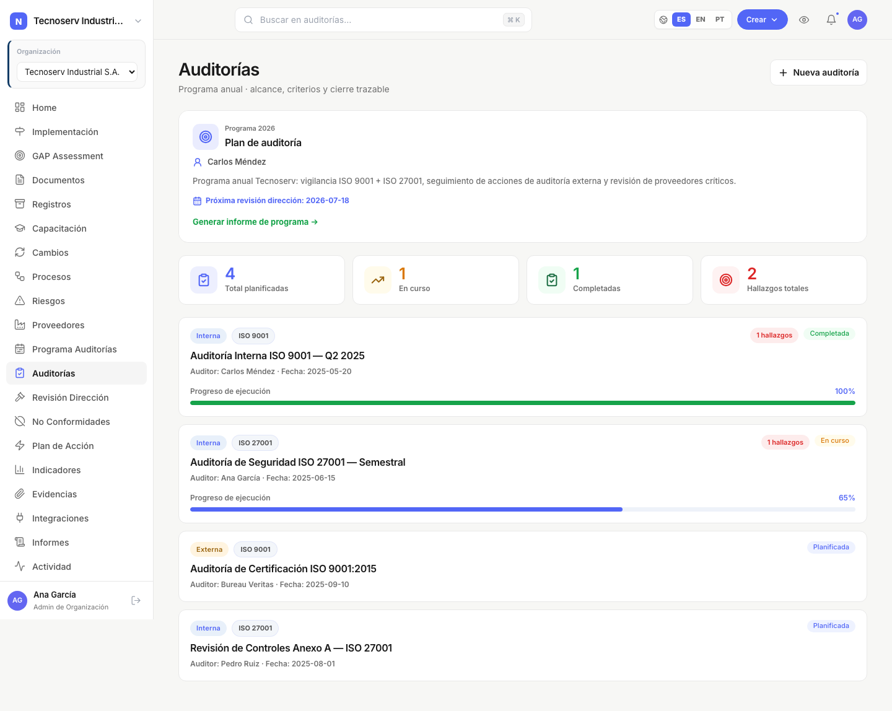

### 5.11. Revisión por la dirección

**Ruta:** Revisión Dirección

Organiza las reuniones de revisión del sistema por la dirección.

**Permite documentar:**

- fecha, título y participantes;
- entradas de la revisión;
- decisiones y temas tratados;
- acciones derivadas;
- seguimiento de acuerdos.

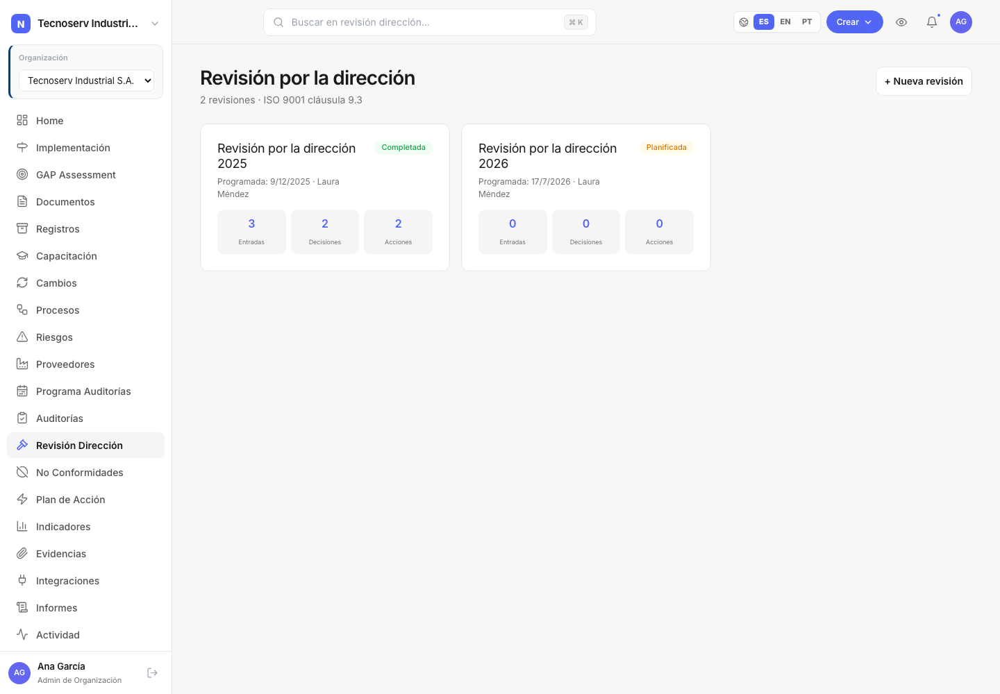

### 5.12. No Conformidades y CAPA

**Ruta:** No Conformidades

Registra desviaciones, hallazgos y problemas que requieren corrección. CAPA significa acciones correctivas y preventivas.

**Flujo recomendado:**

1. Registra la no conformidad con su origen, cláusula y descripción.
2. Analiza la causa raíz.
3. Define una acción correctiva con responsable y vencimiento.
4. Adjunta evidencias de implementación.
5. Verifica la eficacia.
6. Cierra la no conformidad cuando la solución sea efectiva.

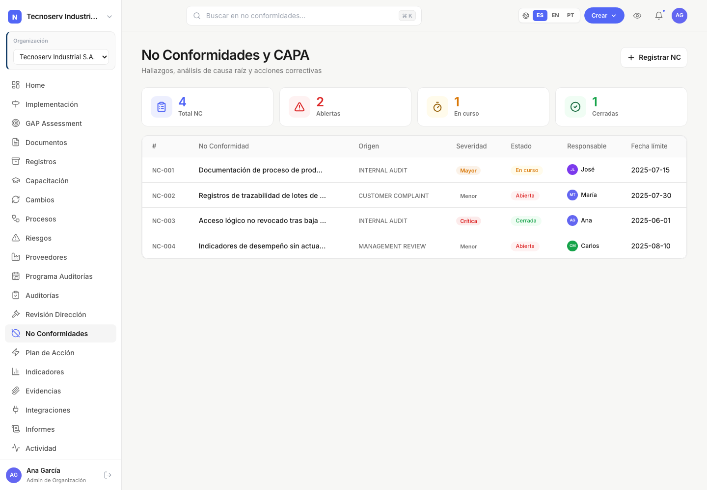

### 5.13. Plan de Acción

**Ruta:** Plan de Acción

Agrupa acciones provenientes del GAP, auditorías, riesgos, no conformidades y revisión por la dirección.

**Qué revisar en cada acción:** responsable, fecha objetivo, prioridad, estado, origen, comentarios y evidencias de cierre.

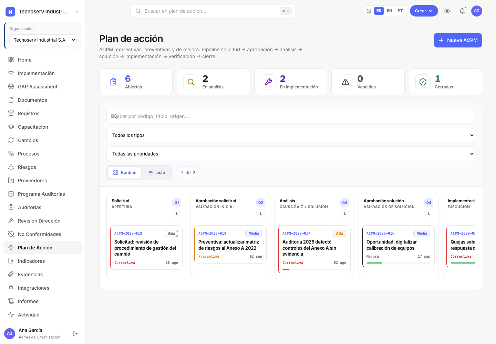

### 5.14. Indicadores y KPIs

**Ruta:** Indicadores

Permite definir indicadores para medir procesos y objetivos.

**Configurar un KPI:**

1. Pulsa **Nuevo KPI**.
2. Define nombre, proceso y responsable.
3. Indica objetivo, unidad, frecuencia y umbrales.
4. Registra valores periódicos.
5. Revisa tendencia y desviaciones.
6. Adjunta evidencias o comentarios de análisis.

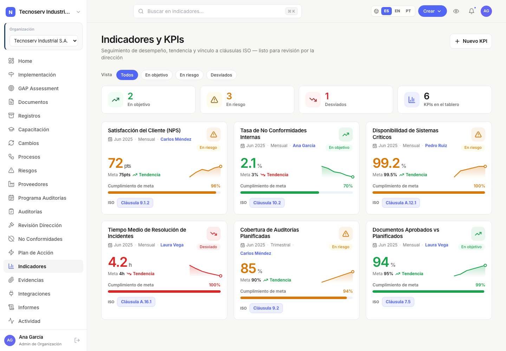

### 5.15. Repositorio de Evidencias

**Ruta:** Evidencias

Centraliza archivos y pruebas que demuestran la ejecución del sistema: actas, registros, capturas, certificados, informes o mediciones.

**Buenas prácticas:** usa nombres consistentes, enlaza la evidencia al proceso o requisito y conserva la fecha y responsable de carga.

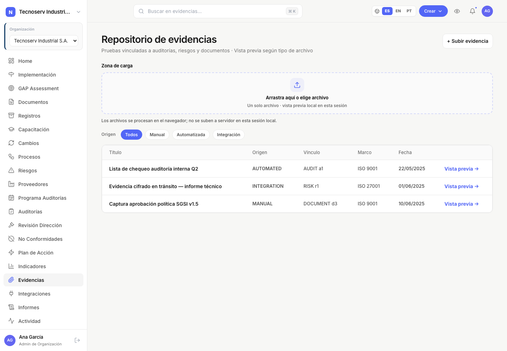

### 5.16. Gestión de Capacitación

**Ruta:** Capacitación

Administra cursos, asignaciones, asistencia, avance y relación con procesos o competencias.

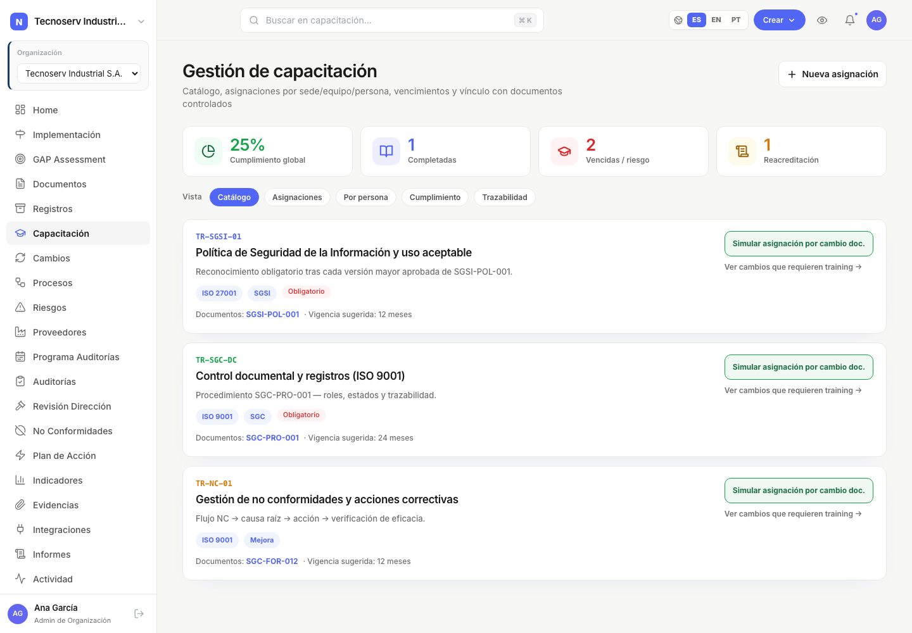

### 5.17. Integraciones

**Ruta:** Integraciones

Muestra el catálogo de conectores previstos para evidencias, identidad y operación. El estado de cada conector se consulta desde esta pantalla.

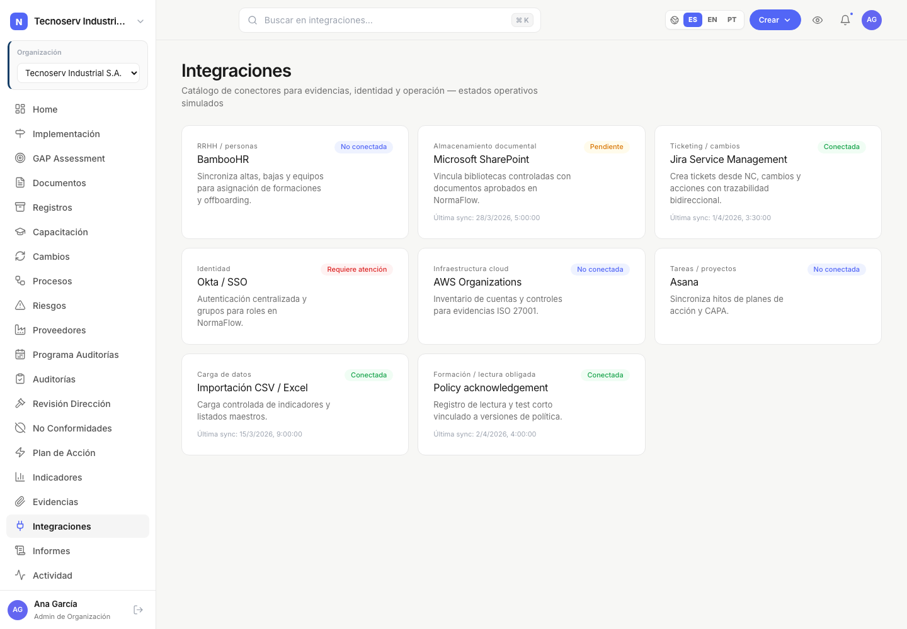

### 5.18. Informes y paquetes de auditoría

**Ruta:** Informes

Prepara paquetes trazables para comité, dirección o auditor externo. La pantalla reúne informes disponibles, exportaciones y el historial de generación.

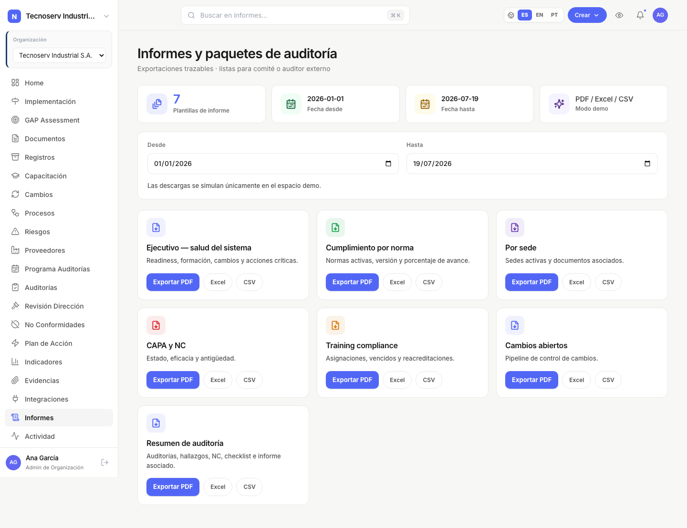

### 5.19. Actividad y audit trail

**Ruta:** Actividad

Permite consultar la línea de tiempo de acciones del sistema. Los filtros ayudan a buscar por actor, acción, entidad o motivo.

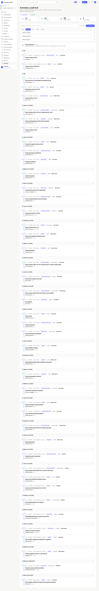

### 5.20. Notificaciones

**Ruta:** Notificaciones

Concentra recordatorios, avisos de vencimiento, aprobaciones pendientes y eventos que requieren atención.

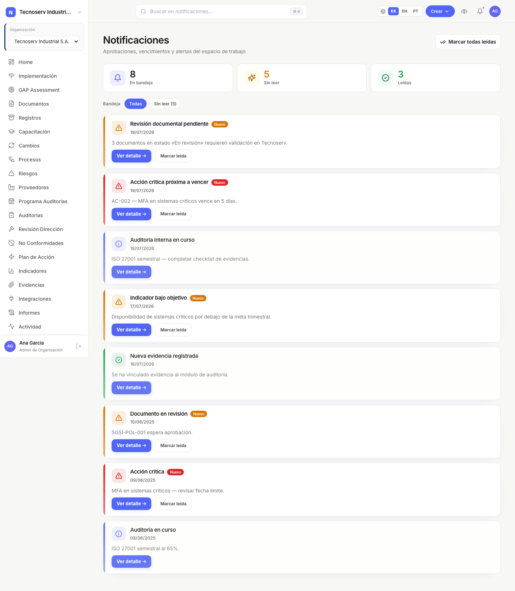

### 5.21. Billing y suscripción

**Ruta:** Billing

Muestra el plan de la organización, límites o consumo y facturas disponibles. En producción se sincroniza con Stripe según la configuración del entorno.

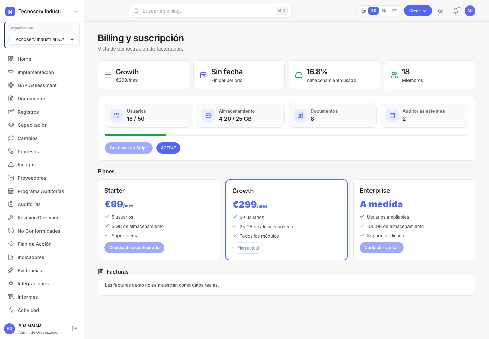

### 5.22. Cuenta y perfil

**Ruta:** Cuenta

Permite revisar y actualizar datos del perfil, organización visible, rol y preferencias de sesión. Desde el menú de usuario también se puede cerrar la sesión.

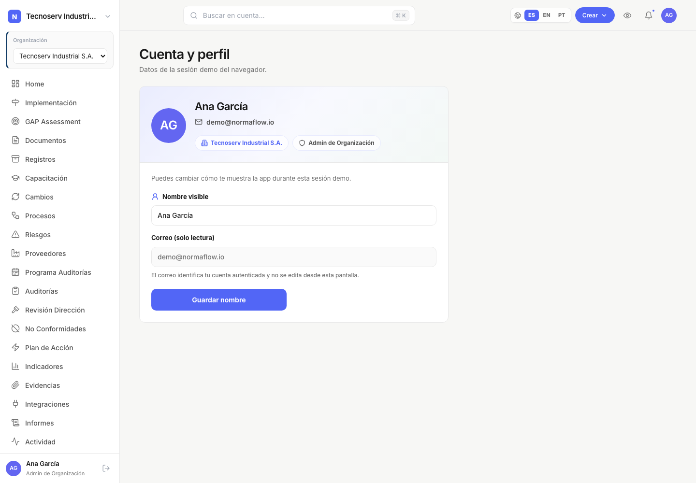

## 6. Roles y permisos

NormaFlow contempla estos roles:

| Rol | Uso habitual |
|---|---|
| **Super Admin** | Administración global de la plataforma. |
| **Admin de Organización** | Configuración de la organización, usuarios, facturación y control general. |
| **Compliance Manager** | Gestión diaria del sistema, documentos, GAP, riesgos, auditorías y acciones. |
| **Auditor** | Planificación y ejecución de auditorías, checklists y hallazgos. |
| **Contribuidor** | Carga y actualización de información operativa según permisos. |
| **Visor** | Consulta de información sin gestión operativa completa. |

El menú y los botones pueden cambiar según el rol. Las acciones de aprobación, cierre, facturación y administración suelen estar restringidas a roles de mayor privilegio.

## 7. Buenas prácticas de uso

- Define códigos únicos para documentos, riesgos, acciones y auditorías.
- Mantén un responsable y una fecha objetivo en cada elemento abierto.
- No cierres una acción sin evidencia de ejecución y verificación de eficacia.
- Relaciona documentos, procesos, riesgos, indicadores y evidencias para conservar trazabilidad.
- Utiliza la revisión por la dirección para consolidar decisiones y prioridades.
- Revisa notificaciones y vencimientos con una frecuencia fija.
- Separa el uso demo del uso live y evita cargar información real en la cuenta de demostración.

## 8. Solución de problemas frecuentes

### No puedo entrar

Comprueba la URL, el correo y la contraseña. En demo, utiliza exactamente las credenciales indicadas en el capítulo 2. En live, confirma que la invitación y la URL de callback de Supabase estén configuradas.

### No veo un botón

Puede depender del rol o del estado del registro. Pide al administrador que revise los permisos de la organización.

### Una pantalla aparece vacía

Comprueba que estás en la organización correcta, recarga la página y revisa si la sesión expiró. Si es una cuenta live, revisa la conexión a base de datos y el estado del servicio.

### No se puede cerrar un registro

Revisa que tenga responsable, fecha, comentarios y evidencia suficientes. Algunos flujos requieren una verificación antes del cierre.

## 9. Checklist rápido para una auditoría

- [ ] Alcance y normas definidos.
- [ ] GAP contestado y brechas priorizadas.
- [ ] Mapa de procesos actualizado.
- [ ] Documentos vigentes y aprobados.
- [ ] Riesgos evaluados y tratamientos definidos.
- [ ] Indicadores con valores recientes.
- [ ] Evidencias enlazadas y localizables.
- [ ] Programa y auditorías registrados.
- [ ] No conformidades y acciones con seguimiento.
- [ ] Revisión por la dirección documentada.
- [ ] Informe o paquete de auditoría generado.
- [ ] Actividad y trazabilidad revisadas.

## 10. Referencia técnica del producto

NormaFlow está construido con Next.js, React, Tailwind CSS, Prisma y Supabase. La autenticación live usa Supabase Auth; el modo demo utiliza una sesión local para facilitar pruebas y demostraciones. El almacenamiento, la facturación, el correo y la IA dependen de las variables y servicios configurados en cada entorno.

Este manual describe la interfaz y los flujos visibles en la versión documentada. Conviene actualizarlo cuando cambien rutas, permisos, formularios o estados de los módulos.
